Controls and tools
===================

Here you can find a description of all the controls and tools that can be added to a web app and how to configure them.

Attributes table
**********************

The attributes table displays attributes associated to features of a given layer.  

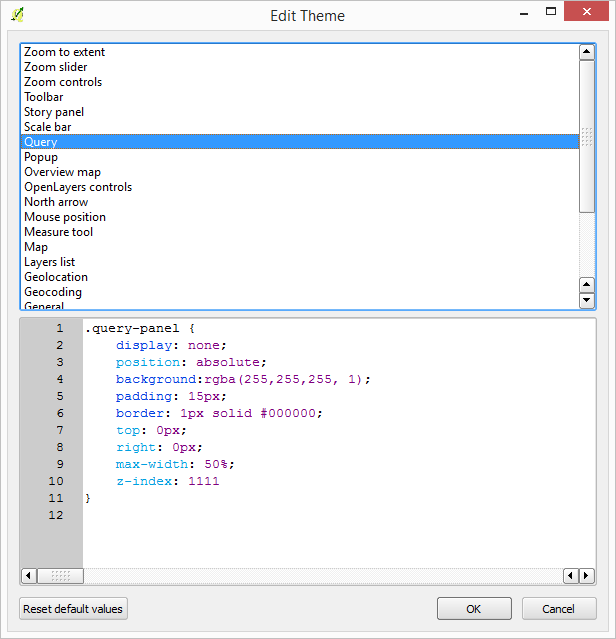

Selected features for the layer are shown in a differente color.

Features can be selected/deselected clicking on the table rows.

Attribution
**********************

OL3 attribution control

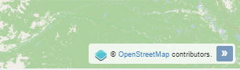

Full screen
**********************

A button to turn on/off the full screen mode.

.. image:: img/fullscreen.png
	:align: center

Layers list
**********************

A control with the list of layers in the map.

.. image:: img/layerslist.png
	:align: center
The following properties can be configured in its configuration dialog.

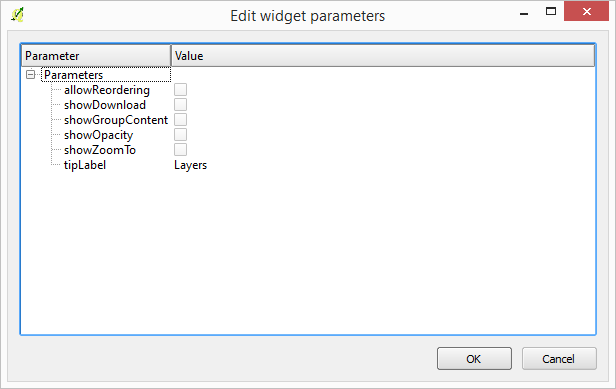

- *tipLabel*: The tooltip to show when mouse is hovered over the layers list.
- *showOpacity*: Show opacity slider, so the user can modify the opacity of layers.
- *showZoomTo*: Show zoom to button, so the user can adjust the extent of the map to the extent of a layer.
- *showDownload*: Show download button, so the user can download the layer in GeoJSON format (only for vector layers).
- *allowReordering*: Allow the user to change the rendering order of layers.
- *showGroupContent*: When a group exists, whether or not to show its layers.

Mouse position
**********************

A control that displays the current coordinates of the mouse as it moves over the map.

The following properties can be configured in its configuration dialog.

- *Coordinate format*
- *Projection*
- *undefinedHTML*

North arrow
**********************

An arrow that indicates the North direction

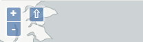

Overview map
**********************

An additional map that shown an overview of the full extent of the are covered by the app.

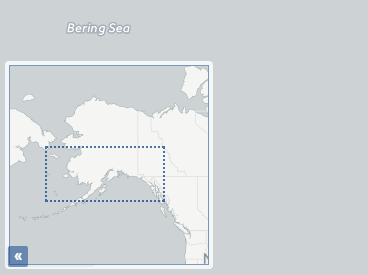

The following properties can be configured in its configuration dialog.

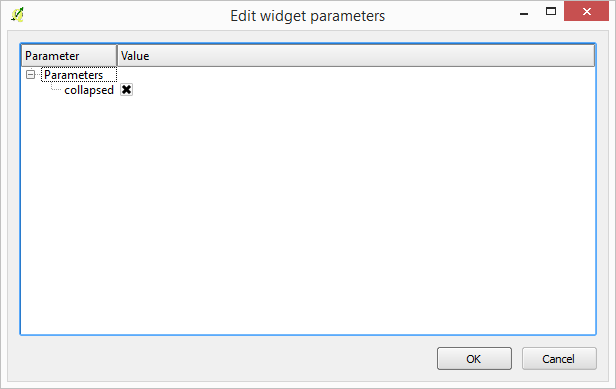

- *collapsed*: Whether the overview map is shown when the app is started.

Scale bar
**********************

A scale bar.

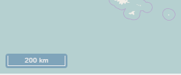

The following properties can be configured in its configuration dialog.

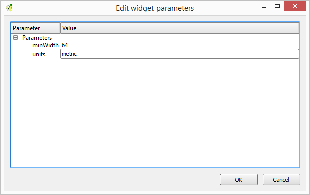

- *minWidth*
- *units*

Zoom controls
**********************

Controls to zoom the map in and out.

.. image:: img/zoomcontrols.png
	:align: center

Zoom slider
**********************

A slider to control the zoom level.

.. image:: img/zoomslider.png
	:align: center

3D view
**********************

A button to turn on/off the 3D mode.

.. image:: img/3dview.png
	:align: center

About panel
**********************

A panel to display text.

A button to turn on/off the full screen mode.

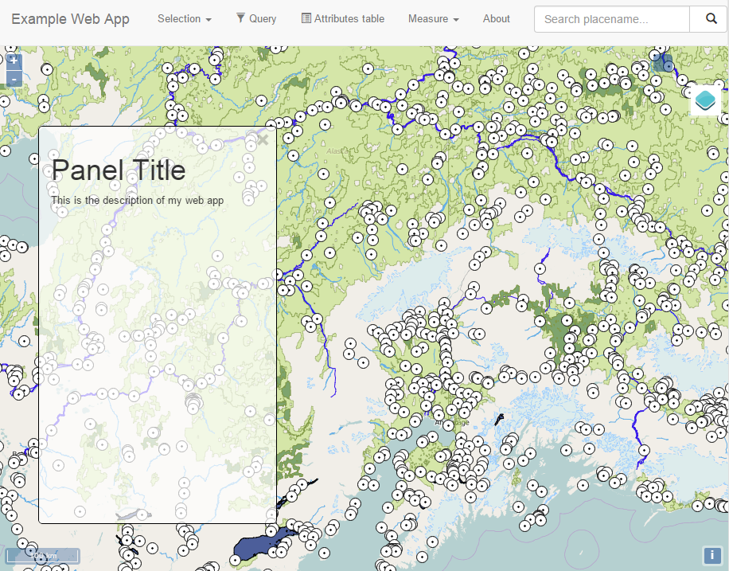

The following properties can be configured in its configuration dialog.

- *content*: The content of the panel. Accepts HTML-formatted text
- *isClosable*. Whether the user can close the panel or not
- *showNavBarLink*: Show a link in the navigation bar to reopen the panel in case it is closed

Export as image
**********************

Adds an option to export the current map view to an image file.

Geolocation
**********************

.. image:: img/geolocation.png
	:align: center	

A control to enable geolocation and use the current position of the user in the map

Measure tools
**********************

Area and length measure tools to be used in the map.

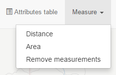

Geocoding
**********************

Geocoding functionality to locate geographic places by name.

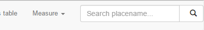

Chart tool
**********************

Tool to create charts based on selected features of a layer.

The configuration dialog of this tool allow to define the charts to add to the web app:

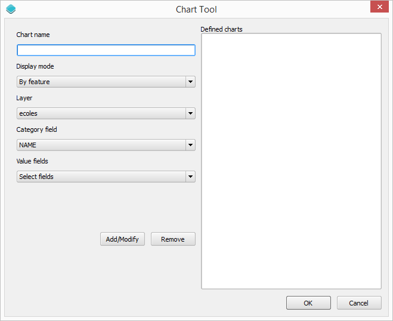

To define a chart, follow these steps:

- Enter the name of the chart. This will be the name displayed in the menu entry used to invoke the chart.

- Select the type of chart in the *Display mode*. This will define how the feature attributes will be used to create the chart. The following options are available:

	- By feature. An element will be added in the chart for each selected feature, and it will display the values of attributes of the feature. The attributes to display are selected in the *Value fields* field. The attribute used to identify each feature in the chart is selected in the *Category field* field.

	- By category. Selected features will be grouped according to a category, and statistics for each category will be displayed. The attributes to compute statistics are selected in the *Value fields* field. The attribute used to group features into categories is selected in the *Category field* field. The statistic function to use is selected in the *Operation for aggregation* field.

	- Count by category. The chart will show the number of features in each category. The attribute used to group features into categories is selected in the *Category field* field.

- Select the remaining attributes depending on the type of chart, as explained above.

- Click on *Add/Modify* to add the chart. It will be added to the list in the right-hand side of the dialog.

Once you have added all the charts that you want to have in your web app, clik *OK* to finish configuring the chart tool.

Links
**********************

Links to external sites. They are added to the navigation bar.

The configuration dialog allows to define new links. 

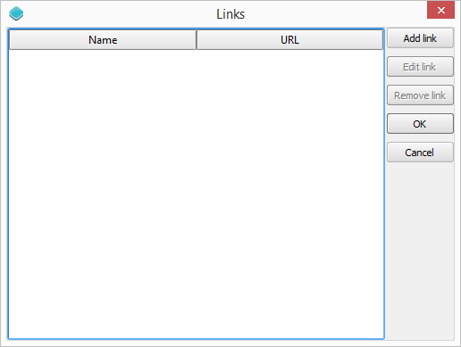

Each link is defined with a name (which will be shown in the navigation bar) and a URL.

Help
**********************

A link to a help doc explaining the web app tools and controls.

Bookmarks
**********************

Spatial bookmarks. 

The configuration dialog allows to define which bookmarks to use and how to show them in the web app. 

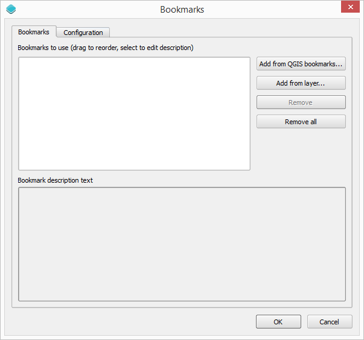

Bookmarks are selected in the *Bookmarks* tab.

A bookmark is composed of a name, an extent and a description.

There are two options for defining bookmarks:

- Using QGIS bookmarks. Click on *Add from QGIS bookmarks* and in the dialog that will appear, select the bookmarks to use from the ones currently stored in the QGIS database. Since those bookmarks do not contain a description, but just name and extent, you should define the description manually, typing it in the *Description* box for each bookmark.

- Using a vector layer. A new bookmark will be added for each feature in the layer, using the bounding box of the feature geometry as the bookmark extent. The name and description of each bookmark will be taken from two attributes in the layer.

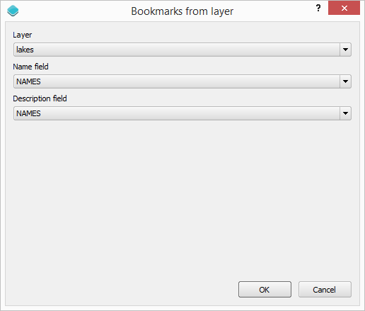

The *Configuration tab* controls how the bookmarks will be displayed. 

If the *Show as story panel* box is checked, a narrative map will be created, and a panel to browse across bookmarks will be added to the web app.

Otherwise, bookmarks will be shown as menu entries in the navigation bar, under a *Bookmarks* menu.

Query
**********************

Query tools to perform selections in layers. 

.. image:: img/query.png
	:align: center	

Queries are expressed using the notation accepted by the `Filtrex <https://github.com/joewalnes/filtrex#expressions>`_ library, which is used for this functionality.

Selection tools
**********************

Tools to select features in the map.

.. image:: img/selectiontools.png
	:align: center	