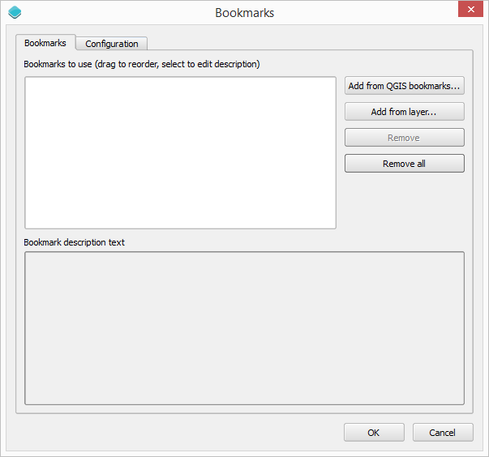
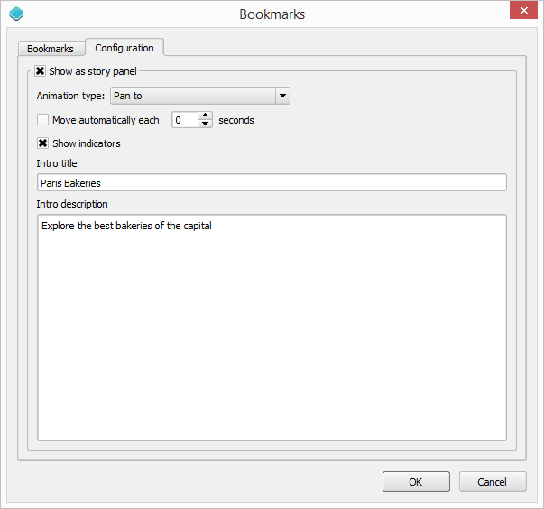
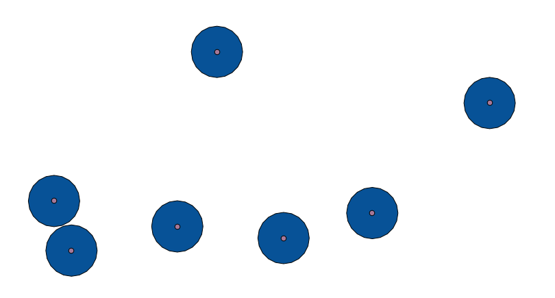

This example shows how to create a different type of web app using the Web App Builder. In this case, we will create a wep app to explore a selection of the best bakeries in Paris, using a storytelling approach.

Data
=====

All data needed for this exercise can be found `here <data/bakeries.zip>`_. T

Setting up the application in QGIS
===================================

Before we use the Web App Builder plugin, we have to set up our data layers in QGIS. The data that we put in the web app will be exactly as it is in QGIS, including the styling. 

Open the QGIS project included in the exercise data. 

.. image:: img/qgisproject.png
	:align: center

There is only one layer and it already has a style that we can use, so there is no need to modify it.

If you open the attributes table, you will see that the layer has several fields with information about each bakery, and a field named *Text* with a HTML-formatted text which includes that information. We will be using this field for showing the description of each bakery. 

Defining the web app
=====================

Start the Web App Builder by selecting the *Plugins/Boundless/Web App Builder* menu.

The following sections describe how to set up the content of each tab in the Web App Builder window

Description tab
----------------

Enter *Paris bakeries* in the title box. Do not enter anything in the *Logo* box.

Select the *full screen* theme.

.. image:: img/descriptiontab.png
	:align: center

Base layer tab
---------------

We will use the OSM base map, since we will need to show the map at a close scale, and the default MapQuest layer does not provide images at that resolution. Unselect the default base map and select the OSM one.

.. image:: img/baselayer.png
	:align: center

Layers tab
-----------

This tab is used to configure which layers from your QGIS project are used, and how they are used. 

Check the bakeries layer and uncheck the *Allow selection* check box, since we do not want to let the user interact with the layer.

Leave the rest of parameters with their default values.

.. image:: img/layers.png
	:align: center

Widgets
--------

This tab is used to select which map controls and tools you want in your web app. For our one, we will only use the *Bookmarks* tool. Unselect the three default ones and select the *Bookmarks* tool.

.. image:: img/widgets.png
	:align: center

We need to configure the bookmarks to use. This is the central part of our web app, since the main functionality will be based on it.

Right click on the *Bookmarks* button and select the *Configure...* option in the context menu. You will see the following dialog.

Bookmarks can be taken from the collection of QGIS bookmarks (which you can create drom the QGIS interface) or using a layer. We will use this last option and generate one bookmark for each bakery location.

Click on the the *Add from layer* button. You will see the following dialog.

.. image:: img/bookmarksfromlayer.png
	:align: center

Select the bakeries layer in the *Layer* parameters. Select *Name* in the *Name field* list and *Text* in the *Description field* list. The content of this two field that we have selected will be used to create the content of the panel that will describe each of the bookmarks. The name will be shown as a header title, and the description text will be shown below in a  normal paragraph.

Click on *OK* and the bookmarks will be added to the list of defined bookmarks for the web app. 

If you select any of the bookmarks in the list, you will see its description text in the lower panel.

.. image:: img/bookmarks2.png
	:align: center

Now move to the *Configuration* tab. We want to display bookmark descriptions in a panel, so check the *Show in story panel* check box. Ther remaining items will become enabled. 

Enter a title and description for the starting slide. These will be used to create the content of the panel when the web app is started, before moving to the first bookmark.

Type *Paris Bakeries* in the title box and *Explore the best bakeries of the capital* in the description one (feel free to add more text if you feel creative)

Change the animation type to *Pan to*.

Click on *OK* to close the bookmark editor dialog.

Settings
----------

We will use all the default settings, so there is no need to modify anything in this tab.

Creating the application
=========================

With the web app already defined, we can now create it by clicking on the *Create App* button. A folder selector dialog will be shown. Select the folder where you want to store the web app. The app will be created and saved to the selected folder. Open the *index.html* file that you will find in that folder to open the web app that we have just created.

Improving the application
==========================

The application is created but, if you open it and use the story panel to visit the different bookmarks, you will notice that the zoom level is to high. That is because the layer that we used for creating the bookmarks is a point layer, so the extent covered by each bookmark is just the point itself, not a real bounding box. That causes the app to zoom to the maximum zoom level.

To solve this, you can use a different layer for computing the extents of the bookmarks.

Open the Processing toolbox and find the *Fixed distance buffer* algorithm. Double-clik on it to open its parameters dialog.

.. image:: img/bufferdialog.png
	:align: center

Use it to compute a buffer around each bakery point. In the *Distance* field, use 0.005. You should get something like this.

Now open back the Web Map Builder. Since you have already created a web app based on this same QGIS project, you will see the following message dialog:

.. image:: img/messagedialog.png
	:align: center

Select *Yes* to recover the configuration parameters that you used when you generated the web app the first time.

Go to the widgets tab and configure the bookmarks tool. In the bookmark configuration dialog you will see that yoiu have all the bookmarks that you defined the last time. Select on *Remove all* to remove them, and then recreate the bookmarks from a layer, as it was already explained. This time, however, use the layer that you got as result from the buffer operation. It has the same attributes table as the original bakeris layer, so you can select the same fields for the title and description. Close the dialog and your bookmarks will be added to the list of the ones to use for the web app. The extent of each bookmark is now larger, as it will use the buffer polygon to define it, not the point.

Create the web app again by clicking on the *Create app* button.

