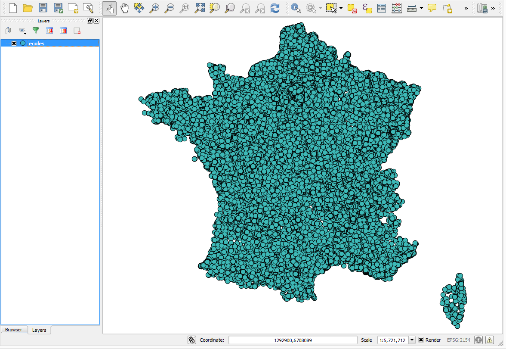
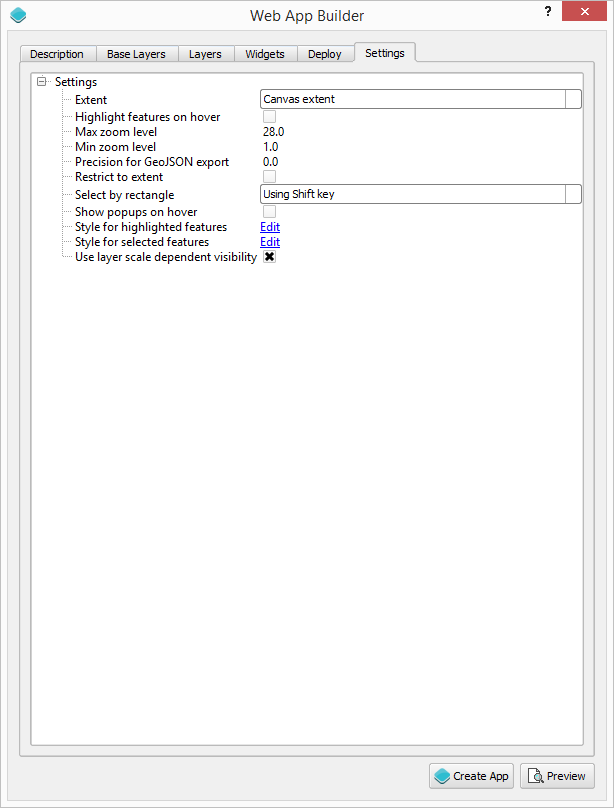
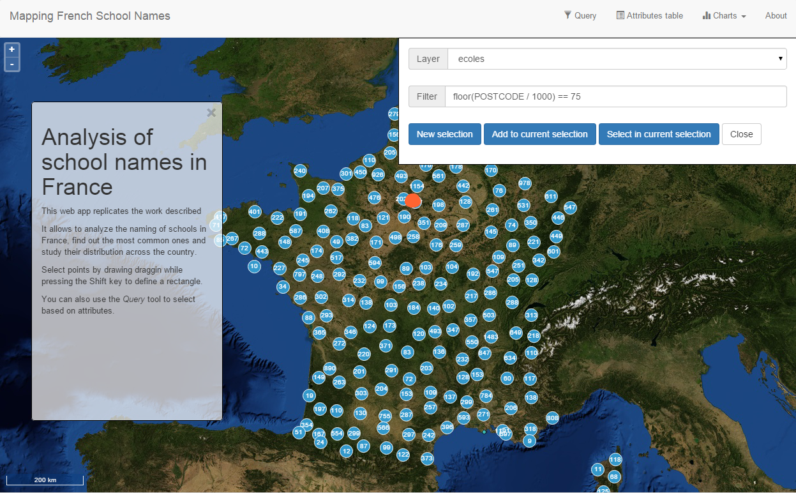
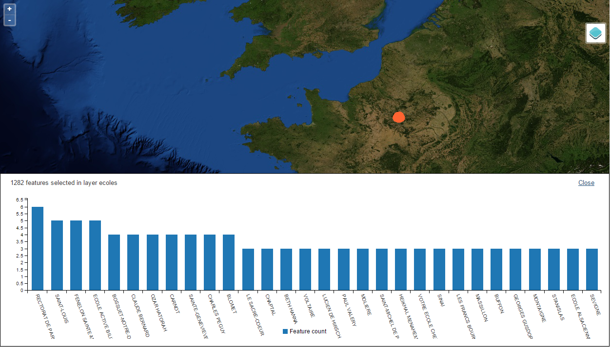
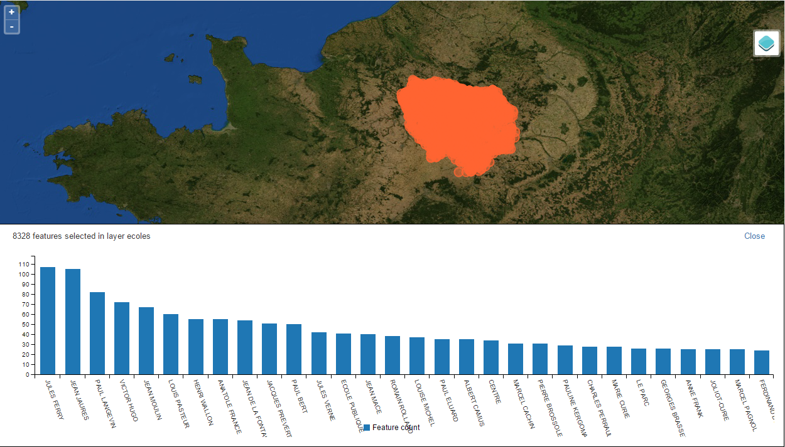

A practical example
********************

This exercise demonstrate how to create a web app using a layer with data for schools in France. By allowing the user to select features in that layer and then create graphs and statistics, the distribution of names can be analized, which turns this app into an interesting tool to analyze the story of the french education system. This app is inspired by a similar work published in `this article <http://www.lemonde.fr/les-decodeurs/article/2015/04/18/de-jules-ferry-a-pierre-perret-l-etonnant-palmares-des-noms-d-ecoles-de-colleges-et-de-lycees-en-france_4613091_4355770.html>`_

Data
=====

All data needed for this exercise can be found `here <data/ecoles.zip>`_. The schools layers is based on the original data from the article linked above, converted to a GeoJSON file, with attribute field names translated into english and some of them removed to reduce the size of the file.

Also, only schools in metropolitan France are considered, to simplify handling projections (the original file has coordinates using several CRSs...all together in the same file)

Setting up the application in QGIS
===================================

Before we use the Web App Builder plugin, we have to set up our data layers in QGIS. The data that we put in the web app will be exactly as it is in QGIS, including the styling. 

Open the QGIS project included in the exercise data. 

You will see that it contains just one layer with a rather basic styling. Since we don't need to add a more complex styling (our web app is more about the data analysis than the map itself), we will leave it as is. 

You will notice that the view is not centered on the extent of the data. Center it or zoom into any place you want to use as your initial extent. When the web app is loaded, it will be focused on that area.

Defining the web app
=====================

Start the Web App Builder by selecting the *Plugins/Boundless/Web App Builder* menu.

.. image:: img/descriptiontab.png
	:align: center

We have several tabs, each one used to define a particular set of parameters. We will go through all of them and describe their meaning.

Description tab
----------------

Enter "Mapping French School Names" in the title box. We will not use any icon, so you can leave the logo box empty.

We will use the default (basic) theme.

Base layer tab
---------------

.. image:: img/baselayer.png
	:align: center

Select the OSM layer as the base layer to use. Since more than one layer can be selected, you will have to unselect the MapQuest layer that is used by default.

Layers tab
-----------

.. image:: img/layers.png
	:align: center

This tab is used to configure which layers from your QGIS project are used, and how they are used. We only have one layer and we will use it, so make sure that the *Schools* layer is checked.

Select the *FIELD:name* option in the popup list. With that, the name of a school will be displayed in a popup when the point that represents it in the map is clicked.

Check the *Allow selection on this layer* box. This is important, since we want the user to be able to select schools, to create their own custom charts based on that selection.

Check the *Cluster* box. Since the number of features is large in the schools layers, clustering will ensure that the web app has good performance when rendering at a large scale. The default clustering distance is fine, so there is no need to modify it.

Widgets
--------

.. image:: img/widgets.png
	:align: center

This tab is used to select which map controls and tools you want in your web app. For our one, we will leave the default three controls (Scale bar, zoom controls, layers list) and add the following ones:

- Attributes table
- Query
- Chart tool
- About panel

The two first ones need no configuration, but *Chart tool* and *About panel* must be configured. 

Right click on the *Chart tool* button and select the *Configure...* option in the context menu. You will see the following dialog.

.. image:: img/charttool.png
	:align: center

Here's where we have to define how to produce the charts when the user makes a selection in the schools layer. We want to count the number of schools with the same name, so we should select *Count by category* in the *Display mode* list. Categories are defined by school names, so the *Name* field has to be selected in the *Category field* list.

Once you have defined the chart parameters, enter a name such as *Count by name* in the name box, and click the *Add/modify* button to add it to the list of charts that will be avilable in the web app. If will be added to the list in the right-hand side of the dialog

.. image:: img/charttool2.png
	:align: center

Click on Ok to finish configuring the chart tool.

Let's configure the about panel now. Right click on it and select *Configure...*. You will see this dialog:

.. image:: img/aboutpanel.png
	:align: center

The only parameter we want to edit is the content of the panel. Click on the *Edit* link to open the following text editor.

.. image:: img/aboutpanel2.png
	:align: center

The content of the panel is defined using plain HTML. Enter the following in the text editor, then close it clicking on OK, and close also the about panel parameters dialog.

::

	<h1>Analysis of school names in France</h1>
	
This web app replicates the work described <a href="http://www.lemonde.fr/les-decodeurs/article/2015/04/18/de-jules-ferry-a-pierre-perret-l-etonnant-palmares-des-noms-d-ecoles-de-colleges-et-de-lycees-en-france_4613091_4355770.html">here</a>

	
It allows to analyze the naming of schools in France, find out the most common ones and study their distribution across the country.

	
Select points by dragging while pressing the Shift key to define a rectangle.

	
You can also use the <i>Query</i> tool to select based on attributes.

As the last step, we will configure the layers list. Open its parameters dialog by right-clicking on it and selectin *Configure...*

Check the *showDownload* and *shownZoomTo* check boxes. That will give the user the option to fit the extent of the view to the layer extent, and also to download the schools layer as a GeoJSON file.

Settings
----------

Some additional parameters can be configured in the last tab of the dialog.

For our web app, we will use all the default values except for the *Select by rectangle* parameter. Set the value of this parameter to *Using Shift key*, to allow the user to select features by drawing a rectangle on the map canvas.

Creating the application
=========================

With the web app already defined, we can now create it by clicking on the *Create App* button. A folder selector dialog will be shown. Select the folder where you want to store the web app. The app will be created and saved to the selected folder.

Some code tweaks
=========================

The code of the application is now in the selected folder and the web app is fully functional. The code, however, can be edited to suit our needs. We will do one small modification.

If you open the *[web_app_folder]/resources/tools.js* file in a text editor and browse to line 622 you will find this:

::

    for (i = 0; i < sorted.length; i++) {
        columns[0].push(sorted[i][0]);
        columns[1].push(sorted[i][1]);
    }

The code takes all the count values and uses them for the chart bars. That might not be a good idea, since there might be too many of them, and in most cases with a count of 1 (most  names might just appear at a single school). It is more interesting to focus on those names that appear in several schools, that is, to focus on the categories that have larger count values.

Replacing the above code with something like this will generate more informative charts:

::

    for (i = 0; i < Math.min(sorted.length, 30); i++) {
        columns[0].push(sorted[i][0]);
        columns[1].push(sorted[i][1]);
    }

The final result
=========================

If you have done all steps above, you should have a working web app in your machine, in the folder that you selected. Open it by opening the *index.html* file that you will find there.

Here are some ideas to test:

French departments (*départements*) are usually referred to by a number. Paris for instance, has number 75. Postal codes on the department always start with the department number, so we can select all schools in Paris by selecting those ones in the form 75XXX.

Open the query tool and enter this in the filter field: 

::

	floor(POSTCODE/1000) = 75

Now click on *New selection*.

The Paris schools will be highlighted. Unlike the unselected schools in the schools layer, selected ones are not clustered.

Now you can open the chart tool and you will see something like this.

To see the attributes associated to each school (and to understand the attribute names we are using in these query expressions), you can close the chart panel and open the attributes table in the web app.

.. image:: img/attributes.png
	:align: center

Here is a more complex example. Let's select all public schools in the Île-deFrance region, which includes Paris. The department numbers in the region are 75,77,78,91,92,93,94 and 95.

Enter the following expression in the query tool and click on *New selection*:

::

	floor(POSTCODE/1000) in  (75,77,78, 91,92,93,94,95) and PUBLIC == "PU"

Open the chart tool and you will see something like this:

You can also shown the location of schools with a given name, using a little trick. The selected features are in a separate layer, which is not shown in the layers list. That means that, if you turn off visibility for the schools layers, the layer with selected elements will still be in the map.

For instance, enter this in the query box and click on *New selection*. 

::

	NAME == "JULES FERRY"

In the layers list, uncheck the schools layer. You should now see something like this:

.. image:: img/julesferry.png
	:align: center

