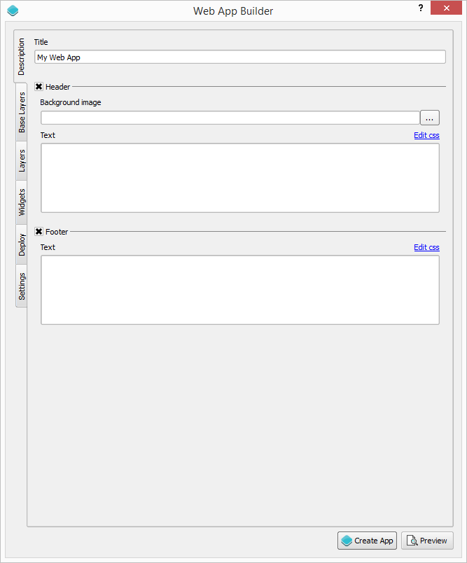
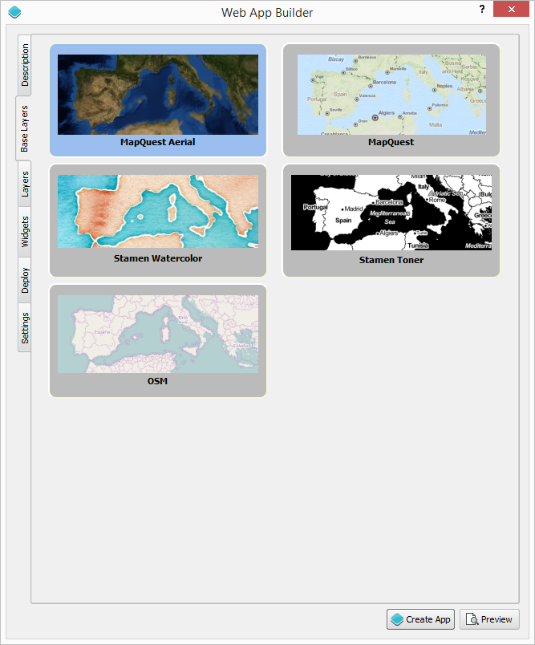
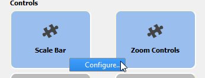
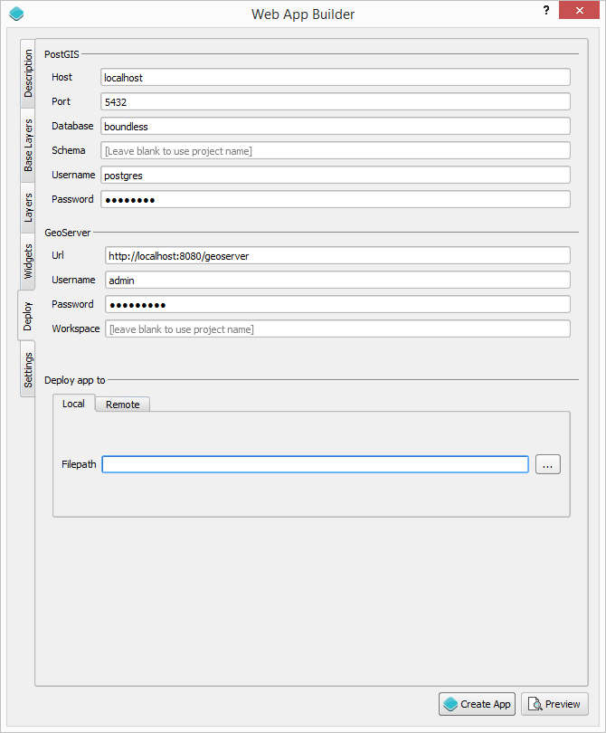
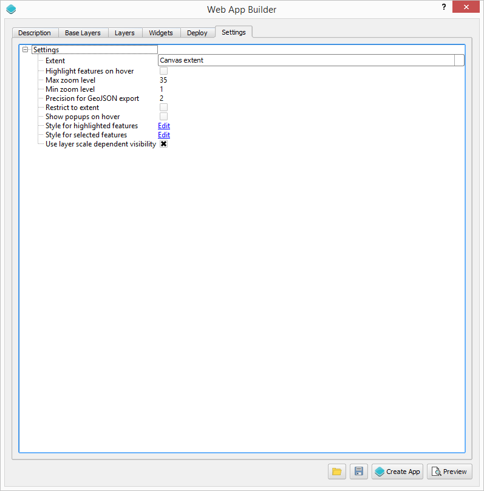

Usage
======

The web app builder is started from the *Plugins/Boundless* menu. It's main dialog looks like this.

To create a web app, define its characteristics using the tabs in the dialog and then press the *Create App* button.

Here's a description of each tab and the elements it contains.

Description
*************

The elements in this tab control the basic structure of the app page. 

Set the title of the project in the *Title* box. In case you want to add a logo along with your title, enter the path to the logo image file in the *Logo* box.

From the available themes, select the one you want to use for your app. A theme defines how the elements of the web app (map, widgets, menus, etc.) will appear. 

Themes have predefined settings, but you can modify them. This is mainly done by modifying the CSS styles that constitute the theme. Clicking on the *Configure theme...* button will open the dialog shown below:

.. image:: img/configuretheme.png
	:align: center

Click on a category in the list in the upper part of the dialog, and its corresponding CSS will be shown in the lower part. Edit the CSS code and click on OK to save your changes.

Changes introduced will not be permanently saved for the selected theme. If you create another web app later using that same theme, it will use the default values for that theme, not your custom ones. 

Base layers
*************

Set the base layers for your application, by clicking on the base layer buttons to select/unselect them. 

Base layers are divided in two groups: layers and overlays. Layers contain the usual base data (roads, topography,, etc.). Overlays are additional layers to put on top of them, all based on available web services. Overlays will be rendered on top of layers.

If you do not want a base layer, you can leave all of them unselected.

Both layers and overlays will be added to a group named "Base layers" in the app, which by default is set as the bottom layer (all remaining layer will be rendered on top of them)

.. image:: img/baselayersselector.png
  :align: center

Layers
*************

.. image:: img/layers.png
	:align: center

From your QGIS project, select the layers that you want to have in your app. The styling of the layers will be used as well, so you should style your layers in QGIS in the same way that you want them to look on your app.

The tab contains a panel with a list of all your layers and groups, and for each of them several options. The options depend on the type of layer. For all of them a check box with the name of the layer controls whether the layer will be added to the app or not. A *visible* check box controls whether the layer will be visible when the app is loaded.

The following is a description of the different options that you might find for each type of layer, and how the app builder deals with each layer type.

Vector layer
-------------

For each vector layer, the following options are available:

- *Info popup content*. Using this option, you can specify the field to use for showing its data in a popup when the features of the layer are clicked or the mouse pointer hovered over them. If the *Show all attributes* option is selected, the whole set of attributes will be displayed. If a given field is selected, the content of the field will be displayed. Formatting is supported, since the content of the field is assumed to be HTML code and will be treated as such. Images can also be included this way.

- *Connect to this layer using*. Determines how to create the data source that will be used by the app. It has the following options.

	- GeoServer -> WFS: The data will be published to GeoServer and then the app will connect to it as a WFS service. Styling will be done client side by the app itself.

	- GeoServer -> WMS: The data will be published to GeoServer and then the app will connect to it as a WMS service. Styling will be done server side by GeoServer.

	- GeoServer -> PostGIS -> WFS: The data will be imported into PostGIS and then a store will be created in GeoServer to consume that data from the PostGIS database. The app will connect to it as a WFS service. Styling will be done client side by the app itself.

	- GeoServer -> PostGIS -> WMS: The data will be imported into PostGIS and then a store will be created in GeoServer to consume that data from the PostGIS database. The app will connect to it as a WMS service. Styling will be done server side by GeoServer.

	- Use file directly. PostGIS and GeoServer will not be used. The layer will be exported to a GeoJson file and the app will use it directly. The file will be saved in the output folder in which the app itself will be created.

- *Allow selection on this layer*. If this check box is selected, the user will be able to select the features in this layer using any of the available selection tools (if added to the web app in the *Widgets* section). If you want to create charts based on the features of a given layer, you should allow selection on it.

In the case of points layers, additional options will be available to cluster point features.

- Cluster points. Check this option to have your point features clustered.

- Cluster distance. Specify the distance to use for clustering.

Raster layers
--------------

For each raster layer, the following options are available:

- *Connect to this layer using*. Determines how to create the data source that will be used by the app. It has the following options.

	- GeoServer -> WMS: The layer will be published to GeoServer and then the app will connect to it as a WMS service. Styling will be done server side by GeoServer.

	- Use file directly. PostGIS and GeoServer will not be used. The layer will be exported to an image file and the app will use it directly. The file will be saved in the output folder in which the app itself will be created.

WMS & WFS layers
-----------------

For WFS and WMS, you will find the same options that for vector and raster layers respectively, except for the *Connect to this layer using* option. The original service will be used, that meaning that no data will be published and the web app will connect to the same service that your QGIS layer is connected to.

Handling projections
---------------------

All layers will be automatically reprojected into the default projection of the OL3 map to create (EPSG:3857) if needed. You can use input  layers in any CRS.

Widgets
********

Use this tab to select the elements that you want in your app.

.. image:: img/widgets.png
	:align: center

They are divided in two group:

-- Controls: OpenLayers controls that act on the map and appear in it. They have the same appearance, regardless of the selected theme.

-- Tools and widgets. Other elements that might or might not be related to the map and its data. Their place in the app and their appearance is controled by the theme. 

Some of this elements can be configured, by right clicking on their corresponding button and selecting the *Configure...* option in the context menu that will appear.

You can find a detailed description of all available controls and tools in the `Controls and tools <./controls.rst>`_ page.

Data deploy
**************

The Deploy tab is used to specify where your data will be stored. It has two groups: *PostGIS* and *GeoServer*. They are used only if your data configuration uses PostGIS or GeoServer (as explained in the *Layers* section). 

Settings
*********

Additional setting can be configured in this tab.

- *Extent*. The extent to use, whether the current extent of the canvas or the minimum one needed to cover all the layers to add to the OL3 map
- *Max zoom level*.
- *Min zoom level*.
- *Restrict to extent*. Do not allow the OL3 map to be panned outside of the extent area
- *Use layer extent visibility*. If defined in the QGIS rendering properties, layers will only be visible in the OL3 map when they are within the allowed scale range.
- *Show popup on hover*.
- *Highlight features on hover*.
- *Style for highlighted features*.
- *Style for selected features*.
- *Precision for GeoJSON export*.

