.. _qgis.webappbuilder.controls:

Controls
========

In this page, you can find the description of all the controls that can be
 added to a web app created by the |current_plugin| and how to configure them.

About panel
-----------

Adds a translucent text panel over the map, usually for describing the app. A
button allows to permanently close the panel.

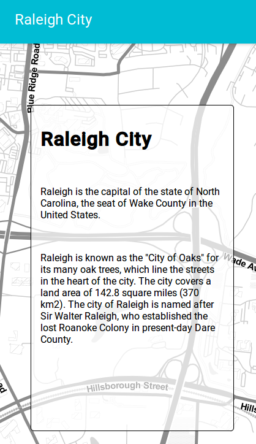

   About panel example

The following properties can be configured for this control:

.. list-table::
   :header-rows: 1
   :stub-columns: 1
   :widths: 20 80
   :class: non-responsive

   * - Option
     - Description
   * - content
     - The content of the panel. Accepts HTML formatted text. Click
       :guilabel:`Edit` to open a text editor.

.. note::

   Being in HTML format, the use of special characters in the about panel
   content must be handled accordingly using HTML code (e.g., quotation marks
   should be replaced by ``&quot;``).

Add layer
---------

Adds a menu entry named *upload* that can be used by the web app user to add
a layer to the map. Only vector layers can be added. Supported formats for
layers are *GeoJSON*, *GPX* and *KML*.

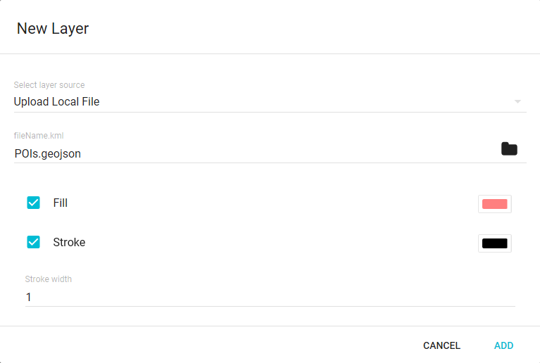

   About panel configuration  

There are no configurable properties for this control.

Attributes table
----------------

Adds a menu entry (or a tab if in tabbed mode) named *table* with the ability
to display a table containing the attributes of the features in a given layer.
Features can be selected/deselected clicking on the table rows. Multiple
selection is available using the shift or ctrl keys. Selected features of
layer are shown in a different color in the map view.

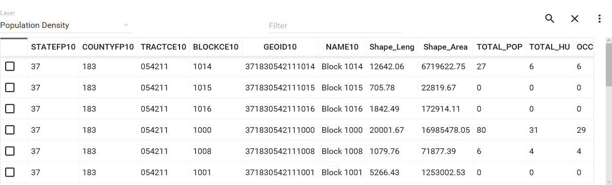

   Attributes table

.. TODO:: This is not implemented yet: If a rendering filter is defined for
   the layer (See :ref:`qgis.webappbuilder.controls.layerlist` control for
   details), those features that are not visible are rendered in a lighter
   color in the attributes table.

The attributes table control came with several tools:
 
* :guilabel:`Layer` combo-box allows to choose what layer to list the
  attributes.
* :guilabel:`Zoom to selected` button will zoom the map view to the selected
  features.
* :guilabel:`Clear` will deselect any selected features.
* :guilabel:`Filter` field allows to filter the table using an expression.
* From the :guilabel:`More options` button, enabling
  :guilabel:`Only show selected` option will hide unselected
  features from the table.

The following properties can be configured for this control:

.. list-table::
   :header-rows: 1
   :stub-columns: 1
   :widths: 20 80
   :class: non-responsive

   * - Option
     - Description
   * - Zoom level when zooming to a point feature
     - If a single point feature is selected in the attributes table in the
       web app, and the Zoom to selected button is clicked, the map zoom will
       be set to this zoom level

Attribution
-----------

Adds an attribution note on the bottom right corner of the map.

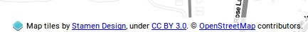

   Attribution

There are no configurable properties for this control.

Bookmarks
---------

Adds the ability to create and retrieve spatial bookmarks. A spatial bookmark
consists of a name, an spatial extent and a description.

Under :guilabel:`Configure...`, the bookmarks are defined in the `Bookmarks`
tab. There are two ways of adding bookmarks:

* *Using QGIS bookmarks*. Click :guilabel:`Add from QGIS bookmarks` and in
  the dialog that will appear, select the bookmarks to use from the ones
  currently stored in the QGIS database. Since those bookmarks do not contain
  a description, but just name and extent, you should define the description
  manually, typing it in the :guilabel:`Description` box for each bookmark.
  Description accepts HTML formatted text.

  .. figure:: img/bookmark_bookmarks_tab.png

     Bookmarks definition

* *Using a vector layer*. A new bookmark will be added for each feature in
  the layer, using the bounding box of the feature geometry as the bookmark
  extent. The name and description of each bookmark will be taken from two
  attributes in the layer. Nevertheless, description can be edited afterward.

  .. figure:: img/bookmarks_from_layers.png

     Add Bookmarks from layer dialog

The :guilabel:`Configuration tab` controls how the bookmarks will be
displayed. If the :guilabel:`Show as story panel` box is not checked,
bookmarks will be shown as menu entries in the navigation bar, under a
:guilabel:`Bookmarks` menu.

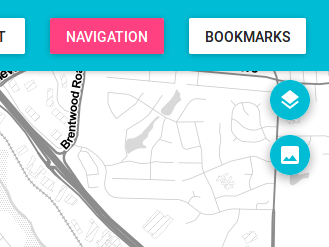

   Bookmarks menu example

Otherwise, if the :guilabel:`Show as story panel` box is checked, a
narrative map will be created, and a panel to browse across bookmarks will
be added to the web app.

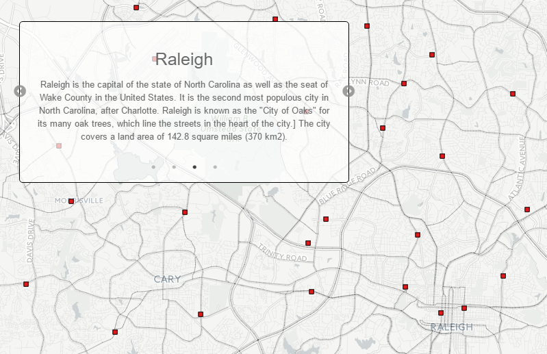

   Story panel

In story panel mode, several options are enabled in the configuration tab:

* :guilabel:`Animation type`: Can choose between `Pan` and `Go to`.
* :guilabel:`Move automatically each X seconds`: will cycle the bookmarks
  automatically in the web app.
* :guilabel:`Show indicators` adds small dots to the panel to serve as
  reference for the relative position of each bookmark.
* :guilabel:`Intro title` and :guilabel:`Intro description` allows adding a
  first panel without spatial bookmark. Both accept HTML formatted text.

.. note::

   Being in HTML format, the use of special characters in the bookmark's
   description must be handled accordingly using HTML code (e.g., quotation
   marks should be replaced by ``&quot;``).

Charts
------

This control allows the creation and display of charts based on the selected
features of a layer.

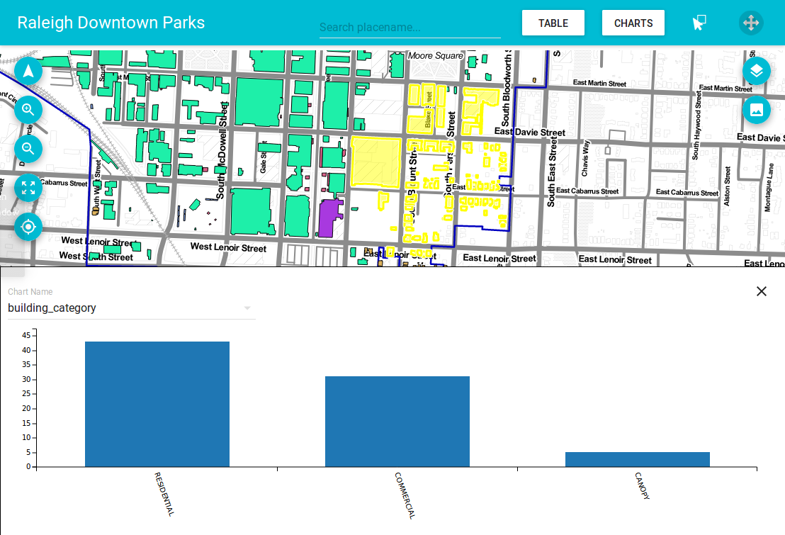

The following properties can be configured for this control:

.. list-table::
   :header-rows: 1
   :stub-columns: 1
   :widths: 20 80
   :class: non-responsive

   * - Option
     - Description
   * - Chart name
     - The title of the chart.
   * - Display mode
     - Defines how the feature attributes will be used to create the chart.
       The following options are available:

       * **By feature**. An element will be added in the chart for each
         selected feature, and it will display the values of attributes of
         the feature. The attributes to display are selected in the
         :guilabel:`Value fields` field. The attribute used to identify each
         feature in the chart is selected in the :guilabel:`Category field`
         field.
       * **By category**. Selected features will be grouped according to a
         category, and statistics for each category will be displayed. The
         attributes to compute statistics are selected in the
         :guilabel:`Value fields` field. The attribute used to group features
         into categories is selected in the :guilabel:`Category field` field.
         The statistic function to use is selected in the *Operation for
         aggregation* field.
       * **Count by category**. The chart will show the number of features
         in each category. The attribute used to group features into
         categories is selected in the :guilabel:`Category field` field.

   * - Layer
     - The layer from which to choose features.
   * - Layer field
     - The layer to use for the chart.
   * - Category field
     - The attribute to use for the chart.
   * - Add/Modify
     - After all the other fields have been populated, this button will add
       the chart to the defined charts list on the right side of the dialog.
   * - Remove
     - Will remove selected chart from the defined charts list.

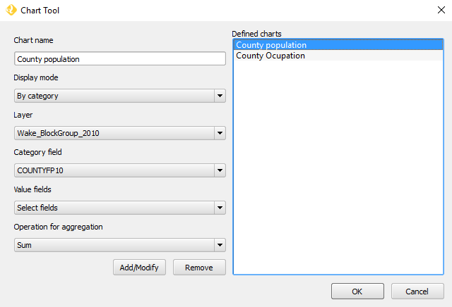

   Chart Tool configuration Dialog

.. note::

   Since only selected features are used in graph, to use this control, you
   need to add the :ref:`qgis.webappbuilder.controls.selection` control to
   the web app as well.

Edit
----

The edit control allows users to add new layers and edit them by adding or
modifying their features.

It adds an *Edit* entry in the web app menu, which opens the edit panel.

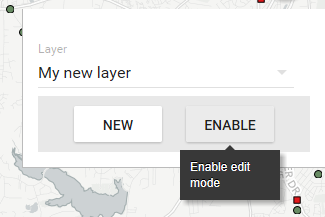

   Edit panel

The edit panel includes several tools:

* :guilabel:`New layer`: Will allow the creation of a new layer using
  through the *Create empty layer* dialog.

  .. figure:: img/edit-create-empty-layer.png

     Create empty layer dialog

* :guilabel:`Layer` combo box: Allows the user to choose which layer to edit.
* :guilabel:`Enable edit mode` / :guilabel:`Disable edit mode`: Toggle edit
  mode for the current selected layer.

There are no configurable properties for this control.

Export as image
---------------

Adds an option to export the current map view to an image file.

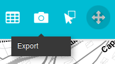

   Export as image menu

There are no configurable properties for this control.

Full screen
-----------

Adds a button to the web app to toggle full-screen mode.

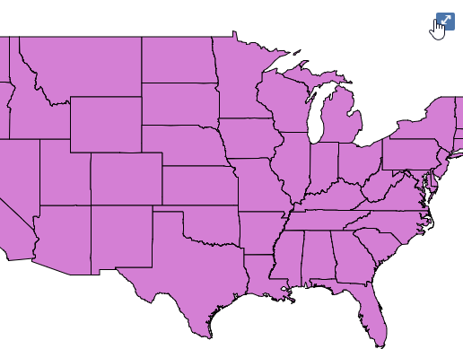

   Full-screen button

There are no configurable properties for this control.

Geocoding
---------

Adds a :guilabel:`Search placename...` field to locate geographic places by
name. If the app uses the basic theme, the tool will be in the menu bar.

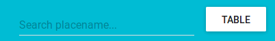

   Geocoding tool in the menu

Otherwise, if the app uses the tabbed theme, the search tool will be
located in a tab.

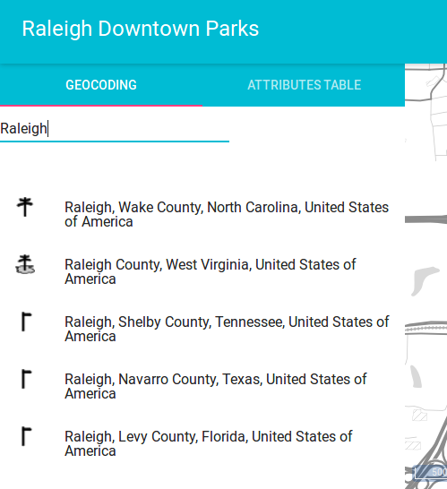

   Geocoding tool in a tab

There are no configurable properties for this control.

Geolocation
-----------

Adds a button to enable geolocation and show the user's current position on
the map.

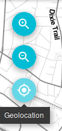

There are no configurable properties for this control.

Help
----

Adds a :guilabel:`Help` button on the menu bar to a help page on how to use
the Web App.

The help page is generated automatically when the Web App is created,
and will only contains information about the controls that are used in it.

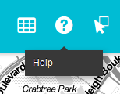

There are no configurable properties for this control.

Home button
-----------

Adds a home button to the web app so it returns to the initial map extent.

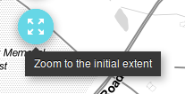

   Home button

There are no configurable properties for this control.

.. _qgis.webappbuilder.controls.layerlist:

Layers list
-----------

Add a button that will open the list of layers in the map. 

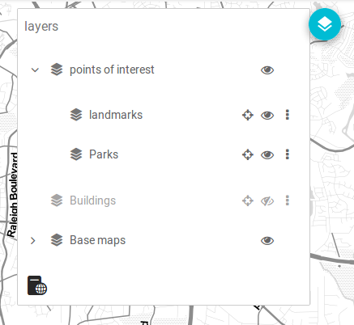

   Layers list example

The following properties can be configured for this control:

.. list-table::
   :header-rows: 1
   :stub-columns: 1
   :widths: 20 80
   :class: non-responsive

   * - Option
     - Description
   * - allowFiltering
     - Allows the user to set filters for conditional rendering. A filter
       button is added to each vector layer entry in the layers list, which
       opens the following dialog:

       .. figure:: img/layerfilters.png

          Layer filters example

       Layer filters are added as filter expressions, using the notation
       accepted by the `Filtrex <https://github.com/joewalnes/filtrex#expressions>`_ library.
   * - allowReordering
     - Allows the user to change the rendering order of layers.
   * - showDownload
     - Show a Download button, so the user can download the layer (vector layers only).
   * - showOpacity
     - Show an opacity slider for each layer.
   * - downloadFormat
     - Choose the format to use for downloading vector layers. Only used if
       showDownload is enabled.
   * - showZoomTo
     - Show Zoom To button, so the user can adjust the extent of the map
       based on the extent of an individual layer.
   * - tipLabel
     - The tooltip to show when the mouse hovers over the layers list.
       Default is Layers.

Legend
------

Adds a button to show a legend explaining the map's symbology used in the web
app layers.

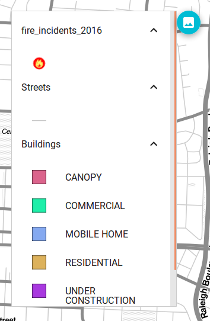

   Legend

A legend entry will be added for all vector and WMS/WFS layers. Raster layers
will not have an entry in the legend.

The following properties can be configured for this control:

.. list-table::
   :header-rows: 1
   :stub-columns: 1
   :widths: 20 80
   :class: non-responsive

   * - Option
     - Description
   * - showExpandedOnStartup
     - If enable shows the legend when the app is opened
   * - size
     - Sets the size of the symbols in the legend.

There are no configurable properties for this control.

Links
-----

Adds links to external sites to the menu bar. Each link is defined
with a name (shown in the navigation bar) and an URL.

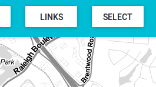

   Links control example

The following properties can be configured for this control:

.. list-table::
   :header-rows: 1
   :stub-columns: 1
   :widths: 20 80
   :class: non-responsive

   * - Option
     - Description
   * - Add link
     - Adds a new link
   * - Remove link
     - Removes a link from the list

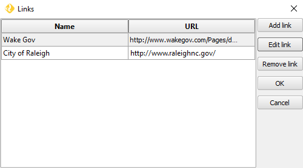

   Links configuration dialog

Loading panel
-------------

Displays a loading indicator while remote layers are being retrieved.

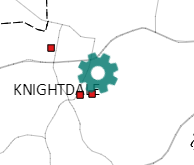

   Loading indicator

There are no configurable properties for this control.

Measure
-------

Adds menu entry with area and length measure tools to the web app.

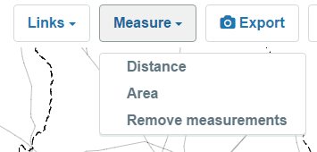

   Measure Tools menu

.. figure:: img/measuretools2.png

   Measure tools example

There are no configurable properties for this control.

Mouse Position
--------------

Adds a control that displays the current coordinates of the mouse as it
moves over the web app map.

.. figure:: img/mouseposition.png

   Mouse Position

The following properties can be configured for this control:

.. list-table::
   :header-rows: 1
   :stub-columns: 1
   :widths: 20 80
   :class: non-responsive

   * - Option
     - Description
   * - projection
     - The CRS to use when determining the units. Default is ``EPSG:4326``.
       Click the *Edit* link to choose another CRS.
   * - undefinedHTML
     - The text to show when the coordinate cannot be computed. Default is
       ``&nbsp;`` or a blank.
   * - coordinateFormat
     - Coordinate format. Default is ``Lat/Lon``, but can also be set
       to ``MGRS``.

North arrow
-----------

Add an arrow button that indicates the north direction. The button can also be
used to reset rotation.

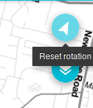

   North arrow

The following properties can be configured for this control:

.. list-table::
   :header-rows: 1
   :stub-columns: 1
   :widths: 20 80
   :class: non-responsive

   * - Option
     - Description
   * - autoHide
     - north arrow button hides if rotation is ``0``

.. _qgis.webappbuilder.controls.overview:

Overview map
------------

Adds an additional map that shows a larger overview of the extent of the area
covered by the app current map view.

.. figure:: img/overviewmap.png

   Overview map

The following properties can be configured for this control:

.. list-table::
   :header-rows: 1
   :stub-columns: 1
   :widths: 20 80
   :class: non-responsive

   * - Option
     - Description
   * - Base layer
     - Allows to choose a base map to the overview map. The user can choose
       between *Use main map base layer* or any of the base layers available
       in the Other Layers tab.
   * - Collapsed
     - If checked, the overview map will not be shown when the app is
       launched. Default is checked.

Print
-----
Adds printing capabilities to the web app.

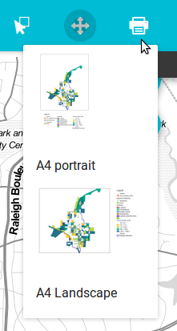

   Print menu example

Printing layouts are designed using the QGIS Print Composer. The Web App
Builder will take the existing print compositions from the current project,
and make them available to users of the web app. The web app will generate
maps in PDF format using the layout designs created in QGIS, and allowing the
user to configure certain parameters, such as the extent of the map or the
content of text labels.

Most elements are supported, including legend, arrow, shape, label and
scalebar. If any of the print compositions in the current project contains
an element that it is not supported (such as, for instance, an attributes
table), a warning will be shown before the web app is created.

Query
-----

Adds a query tools to perform selections in layers. The tools can be
accessed by a Query button on the menu bar. Queries are expressed
using the notation explained in the :ref:`search_filter_notation` section.

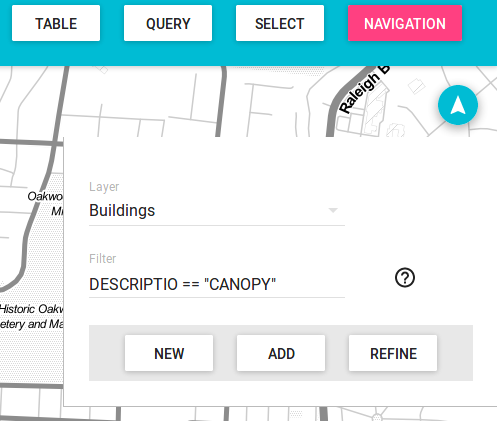

   Query tool

The Query tools include the following options:

* :guilabel:`Layer`: Layer to select from.
* :guilabel:`Filter`: Where the user should put an valid expression.
* :guilabel:`New`: Will create a new selection and clear any
  previous selection on the layer.
* :guilabel:`Add`: Will add new features to already selected
  features. Works as an *OR* operator.
* :guilabel:`Refine` Will only keep features that meet both
  previous selection and the new expression. Works as an *AND* operator.

There are no configurable properties for this control.

Refresh
--------

This component has no visual element. Instead, it makes possible to define
the refresh interval for each available WMS or WFS layers.

To configure the layers to refresh, right-click on the component button and
select "Configure...". You will see a dialog similar to the one below:

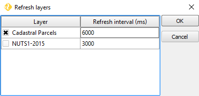

   Refresh layers configuration example

The dialog will show a list of all the WMS or WFS layers that are currently
in your project. If you want any of them to be refreshed, select it by
checking the corresponding check box, and enter the refresh interval in
milliseconds.

Scale bar
---------

Add a scale bar to the bottom left of the map window. 

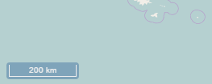

   Scale bar

The following properties can be configured for this control:

.. list-table::
   :header-rows: 1
   :stub-columns: 1
   :widths: 20 80
   :class: non-responsive

   * - Option
     - Description
   * - minWidth
     - Minimum width, in pixels, of the scale bar. Default is ``64``.
   * - units
     - The units to be used in the scale bar. The available options are
       *metric*, *degrees*, *imperial*, *nautical*, and *us*. Default is
       *metric*.

.. _qgis.webappbuilder.controls.selection:

Selection
---------

Adds the ability to select features on the map. Two buttons are added to the
web app: one to enable the selection mode and one to return to navigation mode.

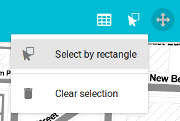

   Selection options in the app

There are no configurable properties for this control.

.. _qgis.webappbuilder.controls.timeline:

Timeline
--------

Adds a slider to the map that can be used to select a given date, and
modifies the visibility of layers and features depending on their timestamp
and the current time as set in the QGIS Layers Tab (see *Layer time info*
option in the :ref:`qgis.webappbuilder.usage.vector` section for more details).

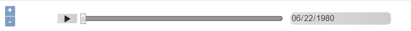

   Timeline slider

Clicking on the play button will cause the slider to advance automatically.
The behaviour of the auto-play mode can be modified using the available
options for this control:

* :guilabel:`interval`. The time, in milliseconds, to wait in each position
  of the slider. Positions are defined by dividing the slider range by the
  number of intervals defined in the numIntervals parameter.
* :guilabel:`autoPlayFromStartup`. Determines if the slider should
  automatically start when the web app opens.
* :guilabel:`numInterval`. The number of intervals into which the full range
  of the slider is divided.

WFS-T
-----

An edit component is added that allows modifying WFS-T layers 

There are no configurable properties for this control.

Zoom
----

Add buttons to zoom the map in and out.

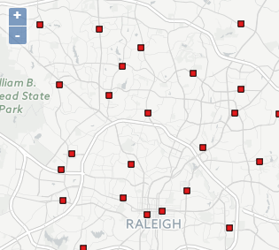

   Zoom buttons

The following properties can be configured for this control:

.. list-table::
   :header-rows: 1
   :stub-columns: 1
   :widths: 20 80
   :class: non-responsive

   * - Option
     - Description
   * - zoomOutTipLabel
     - The text to display when hovering over the Zoom Out button. Default
       is ``Zoom out``.
   * - zoomInTipLabel
     - The text to display when hovering over the Zoom In button. Default is
       ``Zoom in``.
   * - delta
     - Default is ``1.2``.
   * - duration
     - Length of time (in milliseconds) it takes to perform a zoom change.
       Default is 250.
   * - zoomInLabel
     - The text to display on the Zoom In button. Default is ``+``.
   * - zoomOutLabel
     - The text to display on the Zoom Out button. Default is ``-``.

Zoom slider
-----------

Adds a slider bar to control the zoom level.

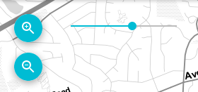

   Zoom slider control

There are no configurable properties for this control.

.. TODO:: Document available filters

.. _search_filter_notation:

Search/filter notation
----------------------

Controls like Query, Attributes, Layers List ca use expression to filter or
search features in a layer. Expression can use the following notation.

Type in a filter expression to narrow your search to one or more attributes.

Examples:

::

     population > 100000

All features with a population greater than 100000

::

    sovereignt == "United Kingdom" and not (subregion like "Europe")

All british colonies not in Europe

Expressions may contain attribute names, strings, numbers, and operators.
Attribute names may be surrounded by single quotes (') to reduce ambiguity.
Strings must be surrounded by double quotes ("). Numbers and operators are
unquoted.

Supported operators are:

.. list-table::
   :header-rows: 1
   :stub-columns: 1
   :widths: 20 80
   :class: non-responsive

   * - Operator
     - Description
   * - a == a
     - a exactly equals b
   * - a != a
     - a does not equal b
   * - a < a
     - a is less than b
   * - a <= b
     - a is less than or equal to b
   * - a > b
     - a is greater than b
   * - a >= b
     - a is greater than or equal to b
   * - a like b
     - b contains a (case insensitive)
   * - a in (x,y,z)
     - a is equal to one or more values in the list x,y,z
   * - e and f
     - Matches both expressions e and f
   * - e or f
     - Matches either expression e or f
   * - not e
     - Returns all results that do not match the expression e

Any expression may be surrounded by parentheses for clarity (e.g. when combining ands and ors).