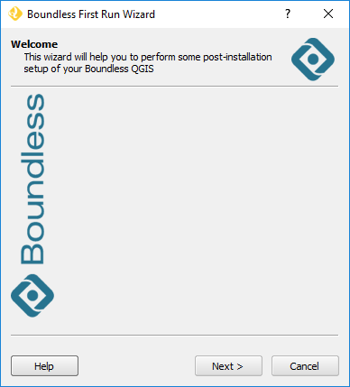
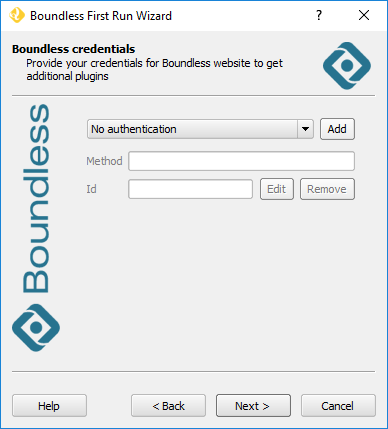
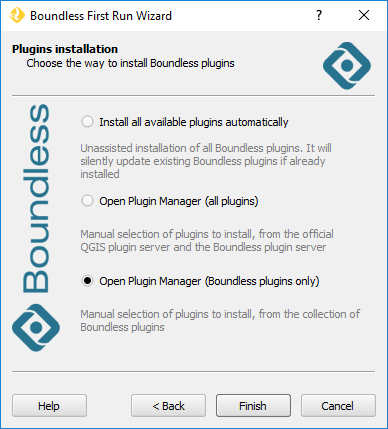
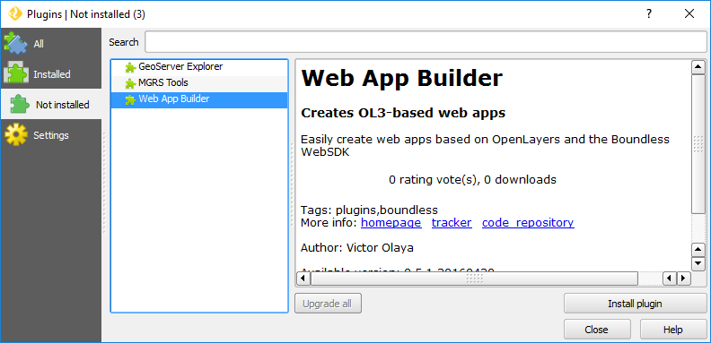

.. (c) 2016 Boundless, http://boundlessgeo.com
   This code is licensed under the GPL 2.0 license.

Installation
============

The easiest way to install |current_plugin| in QGIS is to use the **Boundless Connect Plugin**, a QGIS plugin that will provide you direct access to Boundless plugins and other content.

.. note:: 
   
   If you are using |BLQGIS|, the *Boundless Connect plugin* should be installed by default in its QGIS. Otherwise, if you are using QGIS from one of the community's installers, you can install the *Boundless Connect plugin* by setting up the `Boundless QGIS Plugin Repository`_ in the QGIS plugin manager.

Install from repository
-----------------------

If your organization works either with a remote or local directory-based repository, you can use the *First Run Wizard* tool. Go to the :menuselection:`Plugins --> Boundless Connect` menu and choose :guilabel:`First Run Wizard`. A Welcome dialog will open, click on the :guilabel:`Next` button.

   
   First Run Wizard welcome dialog

If your organization works with a remote Boundless Plugins Repository, the wizard will ask you to enter credentials used to access the repository in the Boundless Credentials dialog, as shown below.

   Wizard credentials dialog

If instead, Boundless Connect plugin was configured to use a local directory-based repository, this step will be skipped. Otherwise, if your organization does not have Boundless authentication credentials, for the |current_plugin|, this step can also be skipped.

In the Plugin Installation dialog, select the last option :guilabel:`Open Plugin Manager (Boundless Plugins only)` and click the :guilabel:`finish` button, as shown in the following figure.

   Wizard Plugin Installation dialog

From the list of uninstalled plugins, choose |current_plugin|, and click on the :guilabel:`Install Plugin` button, as shown below.

   QGIS plugin manager showing Boundless not installed plugins

.. note:: 

   If the |current_plugin| is not visible in the *Not Installed* list, maybe it was installed already. Check the *Installed* list and make sure the plugin is activated by selecting the respective checkbox.
   
Install from a ZIP package
--------------------------

If you have previously downloaded the plugin ZIP package from the `Boundless QGIS Plugin Repository`_ page, you can easily install it using the *Install plugin from ZIP* tool.

Go to :menuselection:`Plugins --> Boundless Connect` and click :guilabel:`Install plugin from ZIP`. Then, simply browse to the ZIP file location, select the file and open it. If  everything went well, you should see a message "Your plugin was successfuly installed" on the top of the map canvas.

.. note:: 
    
   You can download Boundless QGIS plugins ZIP packages from the *Browse the Repository* section in the `Boundless QGIS Plugin Repository`_ page.

.. External links
.. _Boundless QGIS Plugin Repository: http://qgis.boundlessgeo.com
