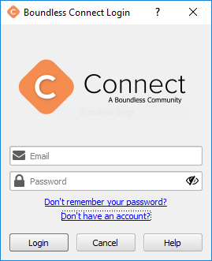
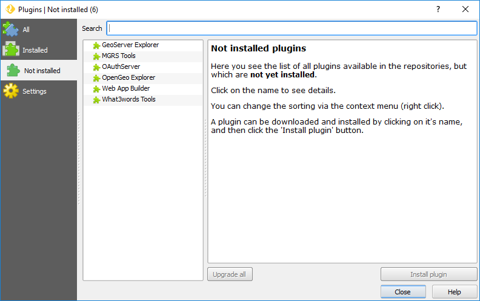

.. (c) 2016 Boundless, http://boundlessgeo.com
   This code is licensed under the GPL 2.0 license.

Installation
============

The easiest way to install the |current_plugin| is to use the **Boundless Connect plugin**, a QGIS plugin that will provide you access to Boundless's plugins and other content.

.. note::

   If you are using |BLQGIS|, the *Boundless Connect plugin* should be installed by default in its QGIS. Otherwise, if you are using QGIS from one of the community's installers, you can install the *Boundless Connect plugin* by setting up the `Boundless QGIS Plugin Repository`_ in QGIS's plugin manager.

Install from repository
-----------------------

If your organization works with Boundless's remote plugin repository, you will need to enter your `Boundless Connect`_ credentials using *Boundless Connect Login* tool. Go to the :menuselection:`Plugins --> Boundless Connect Login` menu. Enter your :guilabel:`Email` and :guilabel:`Password` and click :guilabel:`Login`.

   Boundless Connect login dialog

After entering the Boundless Connect credentials, the QGIS Plugin Manager will open, showing only the uninstalled Boundless plugins available, which makes it easier to find and install Boundless's plugins.

   QGIS plugin manager showing Boundless's not installed plugins

.. note::

   The latter process is a one-time operation for all Boundless's plugins installation, as your credentials will be securely saved within QGIS authentication database for future use. For more information on this subject, please consult the `Boundless Connect plugin's usage documentation`_

If you have entered your Boundless Connect credentials before, or if Boundless Connect plugin was configured to use a local directory-based repository instead of the remote one, there is no need to use Boundless Connect Login tool. Instead, go directly to :menuselection:`Plugins --> Manage and install plugins`, click the :guilabel:`Not installed` tab, and start typing the |current_plugin| name in the :guilabel:`Search` field. Once you locate |current_plugin| in the list of uninstalled plugins, select it and click the :guilabel:`Install Plugin` button.

.. figure:: img/current_plugin_install.png

   QGIS plugin manager with |current_plugin| ready to install

If everything goes well, you should see a message "Plugin installed successfully" on the top of the plugin manager.

.. note::

   If the |current_plugin| is not visible in the *Not Installed* list, maybe it was installed already. Check the *Installed* list and make sure the plugin is activated by selecting the respective checkbox.

Install from a ZIP package
--------------------------

If you have previously downloaded the plugin ZIP package from the `Boundless QGIS Plugin Repository`_ page, you can easily install it using the *Install plugin from ZIP* tool, which is available with Boundless Connect plugin.

Go to :menuselection:`Plugins --> Install plugin from ZIP` menu item. Then, browse to and select the ZIP file, and click :guilabel:`Open` it. If everything went well, you should see a message, on the top of the map canvas, stating that "Your plugin was successfully installed".

.. note::

   You can download Boundless QGIS plugins ZIP packages from the *Browse the Repository* section in the `Boundless QGIS Plugin Repository`_ page.

.. External links
.. _Boundless QGIS Plugin Repository: http://qgis.boundlessgeo.com
.. _Boundless Connect: http://connect.boundlessgeo.com/
.. _Boundless Connect plugin's usage documentation: https://connect.boundlessgeo.com/docs/desktop/plugins/connect/usage.html