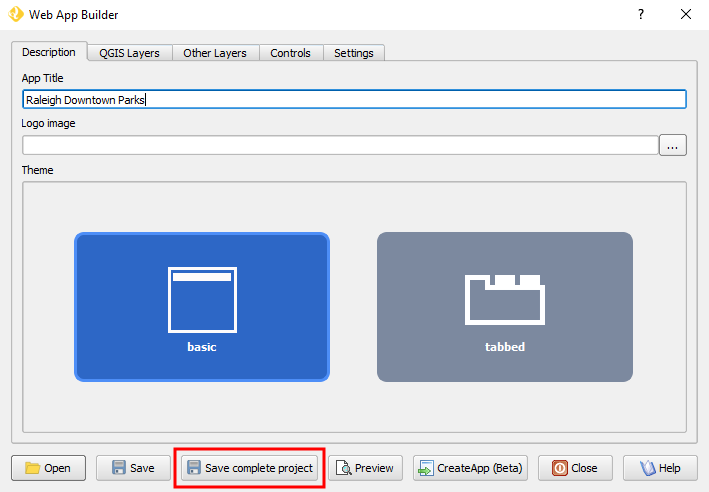

Troubleshooting
===============

In this section, you will find some guidance in case you are having problems
using Web App Builder or the resulting Web Apps are not being built correctly.

.. _common_problems:

Common problems
---------------

Previewed app is empty
......................

You may be using a layer symbology renderer or a Symbol layer
type that is not supported. Check for warning when you click preview, and
see :ref:`limitations` for a list of supported renderers and symbols.

Compiled app is empty
.....................

If the preview app looks good, but your compiled app is empty, make sure you
are serving it using a web server like Apache or IIS. Opening a compiled app
directly from your computer won't work.

Some layers are not rendering well
..................................

If some layers are styled with a blue outline, this means you are using a QGIS
expression that is not supported by WAB. See :ref:`supported_functions`.

Raster layers are now showing in preview
........................................

Raster layers will not be visible if you open the previewed web app directly
from the file system. Instead, the Web App must be served using a web server
like Apache, IIS, or any other.

WAB complains that a layer might be too big
...........................................

If WAB warns you that a layer might be too big for being loaded directly from
a file, you can try to simplify its geometries or subset the layer data.
Otherwise, you will have to serve the layer using web services.

Legends are not showing in the print output
...........................................

For the print widget to work properly, the Web App must be served using a
web server like Apache or IIS.

Layer list widget is not working properly
.........................................

We have identified a couple of issues using Internet Explorer and EDGE, we
suggest you try using the Web App in other browsers like Mozilla Firefox or
Google Chrome.

There was an error loading tiles
................................

To work, OGC layers much be served using Geoserver with CORS/JSONP enabled.
Currently, other web map servers are not supported.

The web app in crashing Internet Explorer
.........................................

We have identified a couple of issues using Internet Explorer and EDGE. Using
a symbol with SVG fills will cause Internet Explorer to crash. Try using the
Web App in other browsers like Mozilla Firefox or Google Chrome, or remove
the SVG fill symbol from the layer.

.. _limitations:

Known limitations
-----------------

* Grouped layers are not fully supported in OpenLayers. Avoid using them if
  you can.
* Not all QGIS layer symbology renderers are supported. Currently, these
  are the supported ones:

  * :guilabel:`Single Symbol`
  * :guilabel:`Categorized`
  * :guilabel:`Graduated`
  * :guilabel:`Rule-based`
  * :guilabel:`heatmap`

* Not all QGIS Symbol layer types are supported. Currently, these are the
  supported ones:

  * :guilabel:`Simple Marker`
  * :guilabel:`SVG Marker`
  * :guilabel:`Simple Line`
  * :guilabel:`Simple Fill`
  * :guilabel:`Gradient Fill`
  * :guilabel:`Point Pattern Fill`

* Rasters *NoData* values will not be be transparent in most browsers.
  Currently, Mozilla Firefox is the exception.
* Raster layer cannot be previewed if the App is not server using a web server.
* Only horizontal labeling is supported.
* Not all vector data-defined properties are supported. Also, using fields
  directly in it is not supported. This is the list of currently supported
  data-define properties:

  * :guilabel:`Line width`
  * :guilabel:`Outline width`
  * Marker symbols :guilabel:`Size`
  * Labels :guilabel:`Text size`

* Label font-family is not supported. All labels will use the same font type.
* Line break in labels isn't supported.
* Not all QGIS expressions are supported (see supported list of expressions
  below).
* Not all style effects are supported.
* Web App will become slow or not work well with large local layer files. You
  should use web services for publishing those layers.
* OGC service layers that are not served by geoserver with CORS/JSONP enabled
  will not render properly.
* SVG Fills doesn't work in Internet Explorer.

Asking for help
---------------

Web App Builder is failing?
...........................

If Web App Builder is failing and you already discarded all the possible
reasons from the :ref:`common_problems` and :ref:`limitations` sections,
please contact the Boundless Support team, providing the following information:

* Full report output from the Boundless Reporting Tool plugin (see
  Reporting tool usage for instructions) for the affected machine;
* A copy of the error message(s).

Getting empty or incomplete Web Apps?
.....................................

If WAB is returning empty web apps or one of its components is not working
properly, and you already discarded all the possible reasons from the
:ref:`common_problems` and :ref:`limitations` sections, please contact the
Boundless team providing:

* a sample of your QGIS project (including sample data);
* the Web App Builder settings used (as a saved :file:`*.appdef` file);
* and the resulting failing app.

For this purpose, we suggest you install the QConsolidate plugin from QGIS's
plugin manager.

With the QConsolidate plugin installed, a new button named :guilabel:`Save
Complete Project` is added to the WAB dialog (you may need to reload QGIS).

Clicking this button will bundle the QGIs project, data, WAB app settings and
the resulting web app in one ZIP file, ready for you to send to our support
team.

.. _supported_functions:

Supported expressions functions and operators
---------------------------------------------

In QGIS, Expressions can be used both in data-defined properties, labels and
the rule-based symbols rendered. For WAB, expressions are only supported in
labels and rule-based symbology, and in a restricted number of data-defined
properties (see :ref:`limitations` for the list of supported data-defined
properties).

Most QGIS operators (-, \*, +, <, >, =, LIKE, etc...) are supported, but not all
functions are supported. Check the following list of supported functions:

.. list-table::
   :header-rows: 1
   :stub-columns: 0
   :widths: 20 30 20 30
   :class: non-responsive

   * - Group
     - Functions
     - Group
     - functions
   * - **Aggregates**
     - * aggregate
       * count
       * count_distinct
       * maximum
       * mean
       * median
       * minimum
       * range
       * stdev
       * sum
     - **Geometry**
     - * area
       * end_point
       * geometry
       * num_points
       * perimeter
       * point_n
       * start_point
       * x
       * x_max
       * x_min
       * y
       * y_max
       * y_min
   * - **Conversion**
     - * to_int
       * to_real
       * to_string
     - **Conditional**
     - * CASE
       * coalesce
       * if
   * - **Math**
     - * abs
       * acos
       * asin
       * atan
       * atan2
       * ceil
       * cos
       * degrees
       * exp
       * floor
       * ln
       * log
       * log10
       * max
       * min
       * pi
       * radians
       * rand
       * randf
       * scale_exp
       * scale_linear
       * sin
       * sqrt
       * tan
     - **String**
     - * char
       * concat
       * format
       * format_number
       * left
       * length
       * lower
       * lpad
       * regexp_replace
       * regexp_substr
       * replace
       * right
       * rpad
       * strpos
       * substr
       * title
       * trim
       * upper
       * wordwrap
   * - **Date and time**
     - * now
     -
     -

Instructions on each expression syntax can be consulted in the `official QGIS
Users Manual <http://docs.qgis.org/latest/en/docs/user_manual/working_with_vector/expression.html?highlight=expressions>`_.