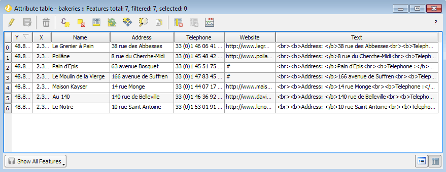

.. _qgis.webappbuilder.tutorials.bakeries:

Mapping Paris bakeries
======================

This example shows how to create a web app using a storytelling approach. In this case, we will create a wep app to explore a selection of the best bakeries in Paris.

Data
----

:download:`Download the data for this tutorial <data/bakeries.zip>`.

This archive contains a single point shapefile, consisting of the locations of bakeries in Paris.

Preparing the application in QGIS
---------------------------------

First, we have to set up our data layers in QGIS. The tutorial data contains a QGIS project. Open it and you will see that it has a single layer.

If you open the attributes table for this layer, you will see that the layer has several fields with information about each bakery, and a field named :guilabel:`Text` with a HTML-formatted text which includes that information. We will be using this field for showing the description of each bakery. 

   Attribute table

Configuring the application
---------------------------

Start the Web App Builder by selecting :menuselection:`Plugins --> Boundless --> Web App Builder`. This will bring up the interface used to configure our web app. There are several tabs, each one used to define a particular set of parameters. We will go through each of them and describe their meaning.

#. In the :guilabel:`Description` tab, fill out the form with the following:

   #. Enter :kbd:`Paris bakeries` in the title box.

   #. Select the :guilabel:`fullscreen` theme.

   .. figure:: img/descriptiontab.png

      Description tab

#. In the :guilabel:`QGIS Layers` tab, fill out the form with the following:

   #. Make sure the :guilabel:`bakeries` layer is checked.

   #. Uncheck the :guilabel:`Allow selection on this layer` check box, since we do not want to let the user interact with the layer.

   .. figure:: img/qgislayerstab.png

      QGIS Layers tab

#. In the :guilabel:`Other Layers` tab, select the :guilabel:`OSM Mapnik` layer.

   .. figure:: img/otherlayerstab.png

      Other Layers tab

#. In the :guilabel:`Controls` tab:

   #. disable all selected controls and select the :guilabel:`Bookmarks` tool. 

   .. figure:: img/controlstab.png

      Controls tab

   #. Right-click the :guilabel:`Bookmarks` tool and select :guilabel:`Configure`. This will be the central part of our web app, since the main storytelling functionality will be based on it.

   #. You will see the following dialog:

      .. figure:: img/bookmarks.png

         Bookmarks dialog

   #. Bookmarks can be taken from a collection of QGIS bookmarks or from a layer. In this case, we will take bookmarks from a layer, generating one bookmark for each bakery location. Click the :guilabel:`Add from layer` button.

   #. In the :guilabel:`Layer` field, select :guilabel:`bakeries`. In the :guilabel:`Name` field, select :guilabel:`Name`. In the :guilabel:`Description` field, selection :guilabel:`Text`. The content of these two fields will be used to create the content of the panel that will describe each of the bookmarks. The name will be shown as a header title, and the description text will be shown below in a normal paragraph.

      .. figure:: img/bookmarksfromlayer.png

         Creating bookmarks from layer

   #. Click :guilabel:`OK`. The bookmarks will be added to the list of defined bookmarks for the web app.

      .. figure:: img/bookmarksadded.png

         Bookmarks added

   #. If you select any of the bookmarks in the list, you will see its description text in the lower panel.

      .. figure:: img/bookmarksselected.png

         Viewing the contents of a bookmark

   #. Click the :guilabel:`Configuration` tab.

   #. Check the :guilabel:`Show in story panel` box, as we want to display bookmark descriptions in a panel.

   #. In the :guilabel:`Intro title` box, type :kbd:`Paris Bakeries`.

   #. In the :guilabel:`Intro description` box, type :kbd:`Explore the best bakeries of the capital of France.`. These will be used to create the content of the panel when the web app is started, before moving to the first bookmark.

   #. Change the :guilabel:`Animation type` to :guilabel:`Pan to`.
   
      .. figure:: img/bookmarksconfiguration.png

         Bookmarks configuration

   #. Click :guilabel:`OK`.

.. note:: There is no need to edit any of the parameters in either the :guilabel:`Deploy` or :guilabel:`Settings` tabs.

Creating the application
------------------------

#. Save the application configuration by clicking the :guilabel:`Save` (disk) icon at the bottom of the dialog.

#. With the configuration defined, we can now create it by clicking the :guilabel:`Create App` button at the bottom of the Web App Builder dialog.

#. Select the directory where you want to store the web app. 

#. The app will be created and saved in this directory. When finished, a dialog will display.

   .. figure:: ../schools/img/deployed.png

      App successfully deployed

#. Click :guilabel:`Yes` to see the deployed app.

Improving the application
-------------------------

If not already open, launch the app by opening :file:`index.html` file inside the directory where you created your web app.

.. todo:: ADD FIGURE

The application is now created but when you move through the story points, you will notice that the zoom level effect is set too high. This is because the layer that used for creating the bookmarks is a point layer, so the extent covered by each bookmark is just the point itself, not a real bounding box. That causes the app to zoom to the maximum zoom level.

As a way to solve this, you can use a different layer for computing the extents of the bookmarks. We will generate one here.

#. Back in QGIS, close the Web App Builder and open the :guilabel:`Processing toolbox` (:menuselection:`Processing --> Toolbox`).

#. Find the :guilabel:`Fixed distance buffer` algorithm (:menuselection:`Geoalgorithms --> Vector --> Geometry operations`) and double-click it to open its parameters dialog.

   .. figure:: img/processingtoolboxbuffer.png

      Fixed distance buffer process in the Processing toolbox

#. In the :guilabel:`Input layer`, make sure that :guilabel:`bakeries` is selected.

#. In the :guilabel:`distance` field, enter :kbd:`0.005`.

   .. figure:: img/bufferdialog.png

      Fixed distance buffer parameters

#. Click :guilabel:`Run` to compute a buffer around each bakery point. The result will be displayed as a new layer in QGIS.

   .. figure:: img/bufferresult.png

      Buffer result

#. Now reopen the Web App Builder. Since you have already created a web app based on this same QGIS project, you will see the following message dialog:

   .. figure:: img/messagedialog.png

      Recovering the application definition

#. Click :guilabel:`Yes` to recover the configuration parameters that you used when you first generated the web app.

#. Go to the :guilabel:`Controls` tab and configure the Bookmarks tool again.

#. Click :guilabel:`Remove all` to remove all existing bookmarks.

#. Recreate the bookmarks in the same way as before, except this time when creating bookmarks from a layer, use the Buffer layer instead of the bakeries layer. It will have the same attributes table as the original bakeries layer, so you can select the same fields for the Title and Description.

   .. figure:: img/bookmarksfromlayerbuffer.png

      Bookmarks from Buffer layer

#. Click :guilabel:`OK` twice, then recreate the web app by clicking the :guilabel:`Create app` button. 

Final result
------------

Open the app and navigate through the story points. You will see that each point zooms to a more sensible area.

.. todo:: ADD FIGURE
