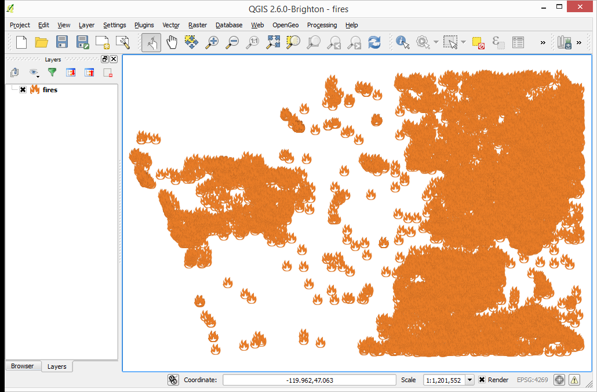
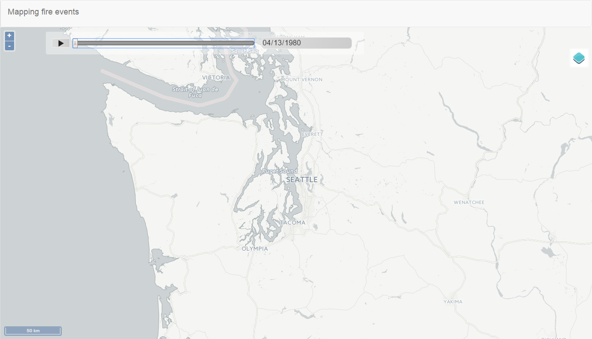
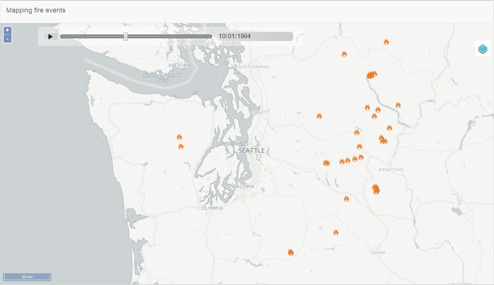

.. _qgis.webappbuilder.tutorials.fires:

Mapping fire events
==========================

This tutorial shows how to create a dynamic web app that shows fire events occurred during a given period of time. It demonstrates the Timeline component and how to use it with layers containing time information

Data
----

:download:`Download the data for this tutorial <data/fires.zip>`.

This archive contains a QGIS project with a points shapefile and it corresponding styling.

Preparing the application in QGIS
---------------------------------

Open the QGIS project in the zip file.

   QGIS project with fire data

The project already has the data and symbology that we will use in the web app, so there is no need for further configuration.

Configuring the application
---------------------------

Start the Web App Builder by selecting :menuselection:`Plugins --> Boundless --> Web App Builder`. This will bring up the interface used to configure our web app. There are several tabs, each one used to define a particular set of parameters. We will go through each of them and describe their meaning.

#. In the :guilabel:`Description` tab, fill out the form with the following:

   #. Enter :kbd:`Mapping fire events` in the title box.

   #. Select the :guilabel:`basic` theme.

      .. figure:: img/description.png

         Description tab

#. In the :guilabel:`QGIS Layers` tab, fill out the form with the following:

   #. Make sure that the :guilabel:`Fires` layer is checked.

   #. Click the :guilabel:`Edit` link to edit the time info of the layer.

   #. Select the :guilabel:`Feature time info is stored in layer attribute` option.

   #. Select the :guilabel:`STARTDATED` field in the :guilabel:`From date field` dropdown list.

   #. Select the :guilabel:`OUTDATED` field in the :guilabel:`To date field` dropdown list.

   .. figure:: img/timeinfo.png

      Layer time infor configuration

   #. Click :guilabel:`OK`.      

#. In the :guilabel:`Other Layers` tab, select the :guilabel:`CartoDB` layer.

   .. figure:: img/otherlayers.png

      Other Layers tab

#. In the :guilabel:`Controls` tab, enable the Timeline component, and leave the three default controls enabled as well.

   .. figure:: img/controls.png

      Controls tab

#. Leave the :guilabel:`Settings` and :guilabel:`Deploy` tabs as they are. There is no need to edit any of the parameters in them.

Creating the application
------------------------

#. Save the application configuration by clicking the :guilabel:`Save` (disk) icon at the bottom of the dialog.

#. With the configuration defined, we can now create it by clicking the :guilabel:`Create App` button at the bottom of the Web App Builder dialog.

#. Select the directory where you want to store the web app. 

#. The app will be created and saved in this directory. When finished, a dialog will display.

   .. figure:: ../schools/img/deployed.png

      App successfully deployed

#. Click :guilabel:`Yes` to see the deployed app.

Final result
------------

If not already open, launch the app by opening :file:`index.html` file inside the directory where you created your web app.

   Deployed app

At the initial time setting, no fire marker are shown, since no fire is active for that time. Move the time slider to set a different time. Points that represent a fire active at the new time set in the time slider will be rendered.

   Deployed app showing fire markers

You can press the play button to active the autoplay mode. The time slider will advance automatically and the map will be updated accordingly.

Showing accumulated results
----------------------------

Using the STARTDATED and OUTDATED fields to define the valid time for each feature, only fires that are active will be rendered. Instead of that, it might be interesting to render all fires that have occurred up to the current date. Follow these steps to create a web app that behaves like that:

#. Open the attributes table of the fires layer.

#. Open the field calculator

#. Fill the fields in the field calculator dialog as shown below.

   .. figure:: img/fieldcalculator.png

      Deployed app

   This will create a new field in the attributes table of the layer, with al features containing the same date. That date corresponds to the latest date in the OUTDATED field.

#. Recreate the web app as explained before, but selecting the newly created LASTDATE field for the :guilabel:`To date field` option in the time info configuration dialog.

The resulting web app will now how all fires that occured before the selected date.
