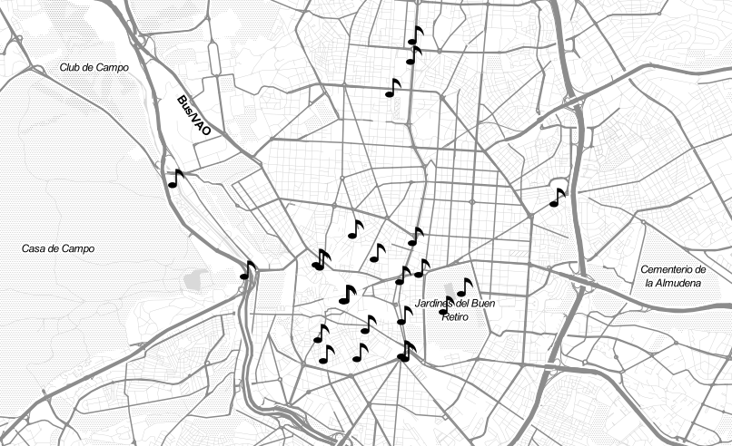
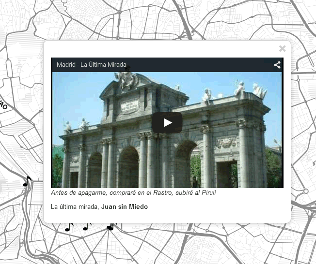

.. _qgis.webappbuilder.tutorials.songs:

Mapping songs about Madrid
==========================

This tutorial shows how to create a web app that explores songs related to the city of Madrid in Spain. For each song, an entry is added to a map, which contains information abut the lyrics and the author. A popup is shown when hovering over each song point, with an embeded video for the song. This app is inspired by a similar work published in `this article in the Huffington Post <http://www.huffingtonpost.es/2015/05/15/canciones-madrid-mapa_n_7214408.html>`_.

Data
----

:download:`Download the data for this tutorial <data/songs.zip>`.

This archive contains a point shapefile with song information, along with an icon that we will use to render song locations on the map.

Preparing the application in QGIS
---------------------------------

First, we have to set up our data layers in QGIS.

#. Add the vector layer to a QGIS project. 

   .. figure:: img/defaultlayer.png

      Layer with default style

#. Improve the default styling by replacing the default symbol with the SVG marker included in the data. (:file:`note.svg`). This can be done in the Layer Properties interface (found by right-clicking the layer name and going to :guilabel:`Properties`.)

   .. figure:: img/style.png

      Adding styling

   .. figure:: img/styledlayer.png

      Layer with SVG marker

Configuring the application
---------------------------

Start the Web App Builder by selecting :menuselection:`Plugins --> Boundless --> Web App Builder`. This will bring up the interface used to configure our web app. There are several tabs, each one used to define a particular set of parameters. We will go through each of them and describe their meaning.

#. In the :guilabel:`Description` tab, fill out the form with the following:

   #. Enter :kbd:`Mapping Madrid songs` in the title box.

   #. Select the :guilabel:`fullscreen` theme.

      .. figure:: img/descriptiontab.png

         Description tab

#. In the :guilabel:`QGIS Layers` tab, fill out the form with the following:

   #. Make sure that the :guilabel:`Songs` layer is checked.

   #. Click the :guilabel:`Edit` link to edit the content of the popup for the layer.

   #. Enter the following in the text box to define the content of the popup::

        [Video]

        
<i>[Lyrics]</i>

        
[Song], <b>[Author]</b>

      This popup will display the embeded video as well as lyrics, song, and author information.

      .. figure:: img/popup.png

         Feature popup

   #. Click :guilabel:`OK`.

      .. figure:: img/qgislayerstab.png

#. In the :guilabel:`Other Layers` tab, select the :guilabel:`Stamen toner lite` layer.

   .. figure:: img/otherlayerstab.png

      Other Layers tab

#. In the :guilabel:`Controls` tab, disable (unselect) all controls. 

   .. figure:: img/controlstab.png

      Controls tab

#. In the :guilabel:`Settings` tab, check the :guilabel:`Show popups on hover` parameter, so popups are shown when passing the mouse over the points without having to click on them.

   .. figure:: img/settingstab.png

      Settings tab

.. note:: There is no need to edit any of the parameters in the :guilabel:`Deploy` tab.

Creating the application
------------------------

#. Save the application configuration by clicking the :guilabel:`Save` (disk) icon at the bottom of the dialog.

#. With the configuration defined, we can now create it by clicking the :guilabel:`Create App` button at the bottom of the Web App Builder dialog.

#. Select the directory where you want to store the web app. 

#. The app will be created and saved in this directory. When finished, a dialog will display.

   .. figure:: ../schools/img/deployed.png

      App successfully deployed

#. Click :guilabel:`Yes` to see the deployed app.

Final result
------------

If not already open, launch the app by opening :file:`index.html` file inside the directory where you created your web app.

   Deployed app

To see the application in action, hover over any of the points on the map.

   Hovering over a point
