.. _qgis.webappbuilder.usage:

Usage
=====

This page will detail how to use the Web App Builder (WAB). For more usage
examples, please see the *"Working with the Web App Builder plugin"* tutorial
in `Desktop Learning Center <https://connect.boundlessgeo.com/Learn/Boundless-Desktop-Learning>`_.

The |current_plugin| is started from the :menuselection:`Web --> Web App Builder --> Web App Builder`
menu item or by clicking the button in the :guilabel:`Web toolbar`.

.. TODO:: Update figure
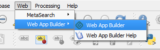

   Menu path to launch the Web App Builder

Once started, the main dialog of the |current_plugin| looks like this:

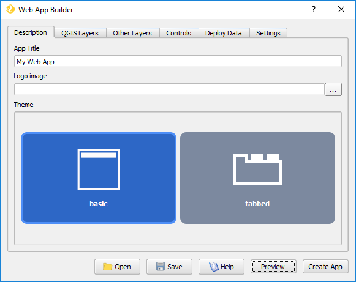

   Web App Builder main dialog - Description tab

At the bottom of the Web App Builder main dialog, there are six buttons
allowing the user to manage your app definitions, as shown below:

.. list-table::
   :header-rows: 1
   :stub-columns: 1
   :widths: 20 60
   :class: non-responsive

   * - Button
     - Description
   * - Open
     - Opens an existing app definitions file (``.appdef``)
   * - Save
     - Saves the current app definitions to a file (``.appdef``)
   * - Preview
     - Shows a preview of the app
   * - Help
     - Brings up the help dialog
   * - Create app
     - Generates the complete app
   * - Close
     - Closes the dialog

The following sections explain each tab in the Web App Builder dialog,
its contents, and options.

Generate a web app
------------------

To generate a web app, you must define its characteristics using the
definitions available in each tab of the dialog and then press the
:guilabel:`Preview` or :guilabel:`Create App` button.

Preview
~~~~~~~

The :guilabel:`Preview` button creates the web app in a temporary
folder and loads it on your default internet browser.

.. note::

   **This preview web app is based on a precompiled version of Web SDK and is
   not ready for production**, but only for preview and debugging purposes.

Create App
~~~~~~~~~~

The :guilabel:`Create App` button creates a fully functional web app
using the *Boundless WebSDK* service.

The user is prompt for a folder to store the web app. After the folder is
chosen, an uncompiled version of the web app is stored in it.

*Boundless WebSDK* is offered as an online service to Boundless customers, so
you will need to be connected to the internet and use your Boundless Connect
credentials (for more information `see <https://connect.boundlessgeo
.com/docs/desktop/plugins/connect/usage.html#boundless-connect-panel>`_ ).

You will be prompted to enter the credentials on the first time you use
WebSDK in a QGIS session.

During compilation, a progress bar shows the compilation status. At any time,
the user can cancel the compilation by clicking :guilabel:`Stop`.

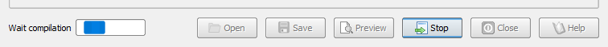

When the compilation process is successfully finished, a dialog opens
informing so, and the user can find the compiled Web App in the chosen folder.

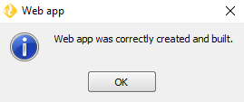

As an alternative, if you do not have access to the WebSDK service provided by
Boundless, you can tell Web App Builder to just create the intermediate files, 
and you can build them later manually with a local installation of WebSDK. 
Usage of WebSDK is not described here. Please refer to the SDK documentation.

To disable compilation of the web app files in the WebSDK servide, disable the 
*UseSDK service to compile app*.

Even if the WebSDK service is used, the source files (in .jsx format) will be 
left in the specified folder, so advanced users can modify them later anb rebuild 
them manually if needed.

Description tab
---------------

The elements in the :guilabel:`Description` tab control the basic structure
of the app page.

Set the title of the project in the :guilabel:`App Title` box. In case you want
to add a logo along with your title, enter the path to the logo image file in
the :guilabel:`Logo image` box.

From the available themes, select the one you want to use for your app. A theme
defines how the elements of the web app (map, widgets, menus, etc.) will
appear visually.

There are two themes: *Basic* and *Tabbed*.

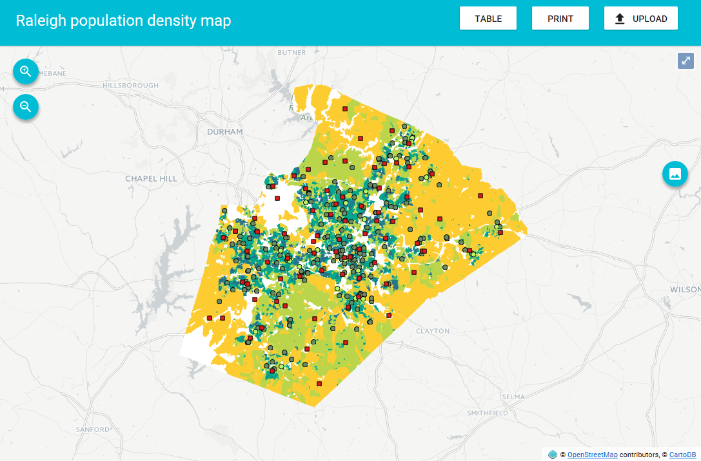

   Basic theme example

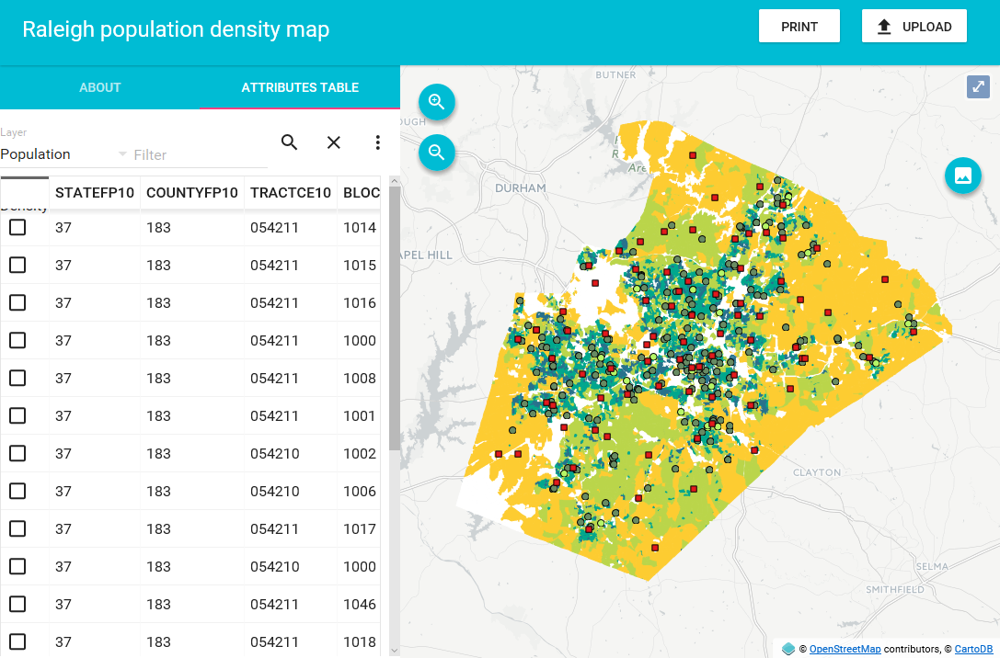

   Tabbed theme example

.. TODO:: Explain differences between the two options

.. _qgis.webappbuilder.usage.qgislayers:

QGIS Layers tab
---------------

This tab you should select which layers from your existing QGIS project that
you would like to add to your web app.

Vector layers will be exported to GeoJSON files and the app will use them
directly. The file will be saved in the output folder in which the app
itself will be created.

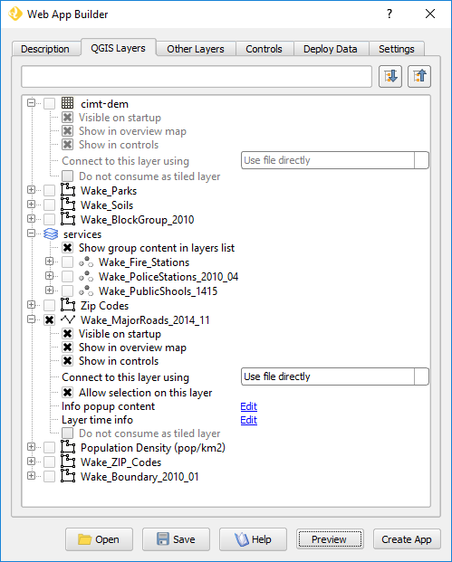

   QGIS Layers tab

Every layer in every group in the QGIS project will be listed in this tab. For
each layer, there are several options which depend on the layer's type. If the
options are not visible, expand them by clicking on the :guilabel:`+` sign.

The following list represents the common options for both vector, raster or
WMS/WFS layers.

* The check box before layer's name controls whether the layer will be added
  to the web app or not.
* The :guilabel:`Visible on startup` check box controls whether the layer
  will be visible by default when the app is loaded.
* The :guilabel:`Show in overview map` check box specifies whether the layer
  will be added to the overview map (if added as a control. see
  :ref:`qgis.webappbuilder.controls.overview` in the :ref:`qgis.webappbuilder.controls` page).
* The :guilabel:`Show in controls` check box specifies whether the layer will be
  added to controls other than the overview map, such as the legend control
  or the layer list (if added as a control).

The following sub-sections describe the different options that you might find
for particular types of layer (:ref:`qgis.webappbuilder.usage.vector` and
:ref:`qgis.webappbuilder.usage.wmswfs`), and how the app builder deals with them.

.. _qgis.webappbuilder.usage.vector:

Vector layers
~~~~~~~~~~~~~

For each vector layer, in addition to the common options, the following
options are available:

* The :guilabel:`Allow selection on this layer` check box specifies whether the
  user will be able to select the features in this layer using any of the
  available selection tools (if added as a control). Notice that, if you want to
  create charts based on the features of a given layer, you should allow
  selection on it.

* :guilabel:`Cluster points`. Check this option to have your point features
  clustered. **Only available for point layers**. To set how your points will
  be clustered set the following options (If the options are not visible, expand
  them by clicking on the :guilabel:`+` sign):

  * :guilabel:`Cluster distance`. Specify the distance (in pixels) to use for
    clustering. Point features next to each other closer than this distance
    will be shown together on the map.

  * :guilabel:`Cluster color`. Specify the color to use for representing
    clusters in the map.

  .. figure:: img/cluster_point_example.png

     Clustered point features example

* :guilabel:`Info popup content`. Using this option, you can specify the content
  of the popup for features in the layer. Click the :guilabel:`Edit` link to
  open the popup editor.
  
  Type the expression to use. For adding the value of a given attribute, enter
  the attribute's name between brackets. Formatting is supported, as the content
  of the field is assumed to be HTML code and will be treated as such. Images
  can also be included this way. For starting up, you can press
  :guilabel:`Add all attributes` to create a simple table with all your layer's
  attributes in a simple table. See the figures below for an expression example:
  
  .. TODO:: update image with example
  .. figure:: img/popupeditor.png

     Popup editor
     
  .. figure:: img/popup_example.png

     Popup info example

* :guilabel:`Layer time info`. You can add time information for layers, which
  will be used by the :ref:`qgis.webappbuilder.controls.timeline` control in
  case it is added. The *timeline* control will control the rendering of
  layers with time information. If the *Timeline* control is not added to the
  web app, the time information will be ignored, and the layer will be
  rendered normally.

  To configure the time information of the layer, click the
  :guilabel:`Edit` label. You will see the following dialog:

  .. figure:: img/timeinfodialog.png

     Time info dialog

  There are three options available:
  
  * :guilabel:`No time info`. The layer will be rendered normally.
  * :guilabel:`Single time info for the whole layer`. The layer will be rendered
    if the current date and time set by the Timeline control falls between
    the two dates defined in the :guilabel:`From date` and :guilabel:`To
    date` boxes.
  * :guilabel:`Feature time info is stored in layer attribute`. Each feature has
    a different pair of to/from dates, and will only be rendered if the
    current time falls between them. The fields in which the dates are stored
    are selected using the :guilabel:`From date field` and :guilabel:`To date
    field` dropdown menus. Fields type must be strings, and the values must
    be dates in ISO 8601 format, that is, YYYY-MM-DD.

* :guilabel:`Do not consume as tiled layer`. In certain cases, you might not
  want to use a tiling strategy for remote layers. If this option is selected,
  WMS layers won't be accessed as tiles, and WFS layers will be downloaded
  completely instead of using a bounding box strategy based on the current
  extent of the map.

.. _qgis.webappbuilder.usage.wmswfs:

WMS/WFS layers
~~~~~~~~~~~~~~

For WMS layers, the :guilabel:`Info popup content` option will work similar
to the case of a vector or WFS layers, but with a small limitation. The
attribute names will not be shown in the popup editor since there is no
information in QGIS about them. You can use the same syntax that was
explained for vector layer popups, in case you know the attribute names.
Otherwise, you can click on the :guilabel:`Add all attributes` button to add
all attribute names and values to the popup content. The popup will show the
full feature information as it is returned by the WMS service when it's
queried using its GetFeatureInfo method.
  
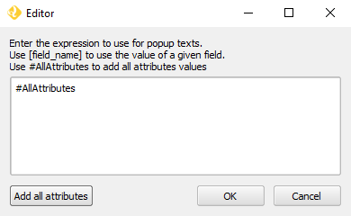

   Popup editor for WMS layers

.. note::

   WFS or WMS layers behind authentication are not supported yet. Currently, if
   OWS layers with authentication are added, the app creation may fail, or
   these layers won't be visible.

Handling projections
~~~~~~~~~~~~~~~~~~~~

If needed, all layers will be automatically reprojected into the projection
of the map to be created (by default, EPSG:3857, but can be set in the
:ref:`qgis.webappbuilder.usage.settings` tab). Therefore, you can use input
layers from any CRS.

File-based layers will be reprojected beforehand. Layers from OWS services will
be reprojected on-the-fly in the web app, **which might cause performance issues**.

Other layers
------------

The `Other Layers` tab allows you to add other layers to your application.
You can select or deselect these layers by clicking the buttons.

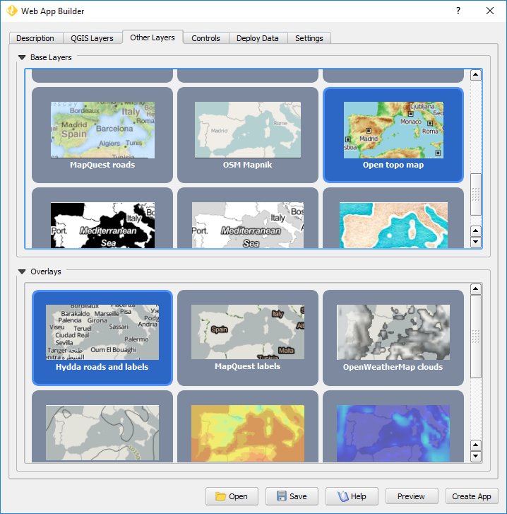

   Other layers tab with "Carto DB" base layer selected

You can select from a list of **Base Layers**, which will be displayed below
your layers and **Overlays**, which can be shown alongside with your layers.

`Base Layers` contain data such as roads and topography, while `Overlays` are
usually complementary layers that would serve as additional information
(such as places names labels). Both lists content based on available web
services. For adding more services see :ref:`qgis.webappbuilder.baselayers`.

.. note:: Selecting Base Layers or Overlays is entirely optional.

`Base Layers`, by default, will be added to a group named "Base layers" in
the app, which is set as the bottom layer and the user can't reorder
it. `Overlays` will be added to a group named "Overlays", which is set by
default as the top layer, but the web app user might be able to reorder it
using the `Layer List` control if the :guilabel:`allowReordering` option is
selected in its configuration. See :ref:`qgis.webappbuilder.controls.layerlist`
settings in the :ref:`qgis.webappbuilder.controls` page for more details.

.. figure:: img/baselayersselector.png

   Base layers in a web app

Controls tab
------------

The `Controls` tab allows you to select extra elements that you would like to
add to your web app. These can be OpenLayers controls that act on the map
and appear in it, or other elements that may or may not be directly related to
the map data. Their place in the app and their appearance is controlled by
the theme.

Controls are activated by clicking their button.

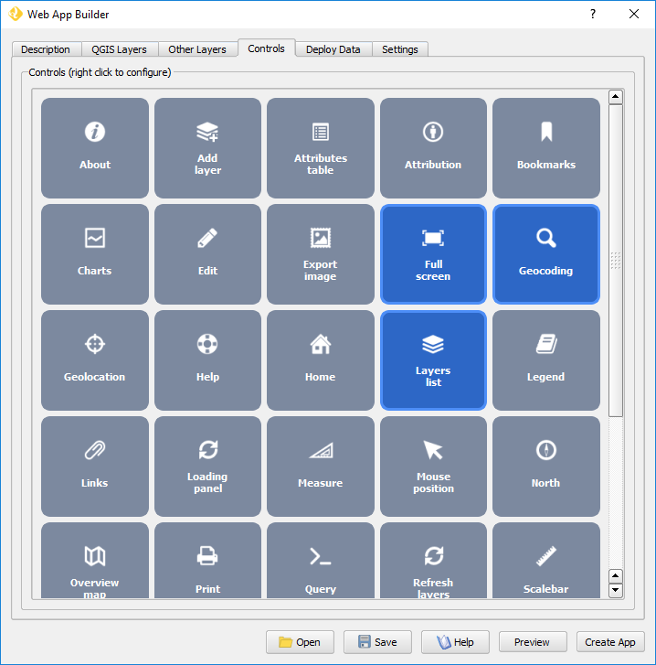

   Controls tab with Full screen, geocoding and Layers list selected

Some controls can be configured by right-clicking their corresponding button
and selecting the :guilabel:`Configure` option.

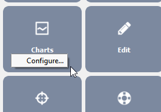

   Right-click a control to access configuration

For a more detailed description of all available controls and their settings
see the :ref:`qgis.webappbuilder.controls` page.

.. _qgis.webappbuilder.usage.settings:

Settings tab
------------

The `Settings` tab shows additional configuration for the application:

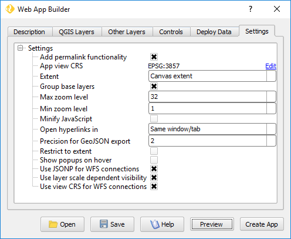

   Settings tab

.. list-table::
   :header-rows: 1
   :stub-columns: 1
   :widths: 20 80
   :class: non-responsive

   * - Setting
     - Description
   * - Add permalink functionality
     - Creates URLs with map current Zoom/Extent information allowing the
       user to share a link with an exact position.
   * - App view CRS
     - The CRS of the finished map. The default is ``EPSG:3857`` (Web Mercator).
       Can be set to other CRS by clicking the :guilabel:`Edit link`.
   * - Extent
     - The extent of the map. There are two options: :guilabel:`Canvas
       extent`, which uses the current state of the QGIS canvas, or
       :guilabel:`Fit to Layers extent`, which will calculate the extent based
       on the union of all the layers in the project.
   * - Group base layers     
     - Whether to put all base layers under a layer group or add them as
       individual layers.
   * - Max zoom level
     - Maximum zoom level available in the web app, as related to the CRS.
   * - Min zoom level
     - Minimum zoom level available in the web app, as related to the CRS.
   * - Minify JavaScript
     - Minify the JavaScript code generated by the Web App Builder.
   * - Precision for GeoJSON export
     - Number of decimal places to use when exporting features using GeoJSON.
       Higher numbers increase accuracy but also data size. The default is 2.
   * - Restrict to extent
     - Do not allow the map to be panned outside of the extent.
   * - Show popups on hover
     - When selected, a feature's popup will be shown when the mouse rolls over
       the feature. Otherwise, the feature will need to be clicked for the
       popup to display.
   * - Use JSONP for WFS connections.
     - Uses JSONP for WFS connections.
   * - Use layer scale dependent visibility
     - If defined in the QGIS rendering properties, layers will only be
       visible on the map when they are within the defined scale range.
   * - Use view CRS for WFS connections. 
     - If checked, it will request data for a WFS layer using the CRS of the
       web app view. Otherwise, it will request the data in the CRS that is
       used in the QGIS layer, and reproject it client-side before rendering
       it in the web app view.