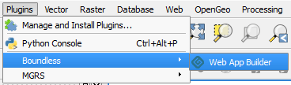
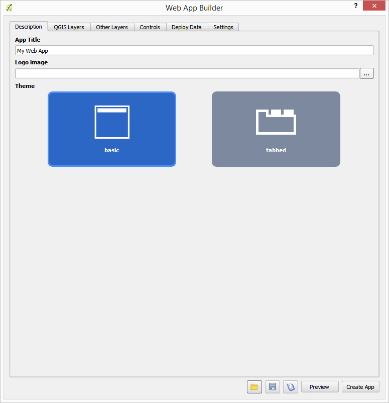
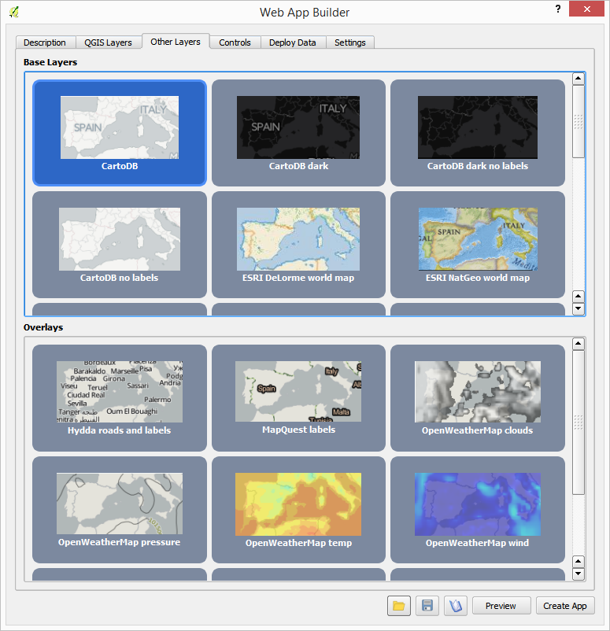
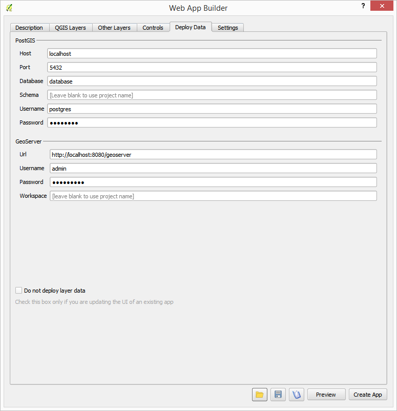

.. _qgis.webappbuilder.usage:

Usage
=====

The page will detail how to use the Web App Builder. For more information, please see the :ref:`qgis.webappbuilder.tutorials`.

The Web App Builder is started from the :menuselection:`Web --> Boundless --> Web App Builder` menu.

   Menu to launch the Web App Builder

Once launched, the main dialog looks like this:

   Main dialog

**To create a web app, define its characteristics using the tabs in the dialog and then press the Create App button.**

Below is a description of each tab and its contents.

Description
-----------

The elements in the Description tab control the basic structure of the app page.

Set the title of the project in the :guilabel:`App Title` box. In case you want to add a logo along with your title, enter the path to the logo image file in the :guilabel:`Logo image` box.

From the available themes, select the one you want to use for your app. A theme defines how the elements of the web app (map, widgets, menus, etc.) will appear visually.

There are two themes: Basic and Tabbed.

QGIS Layers
-----------

This tab is where you can select the layers from your existing QGIS project that you would like to add to your web app.

.. figure:: img/qgislayers.png

   QGIS Layers tab

Every layer in every group in the QGIS project will be listed in this tab. For each layer, there are several options depending on the type of layer.

* A check box with the name of the layer controls whether the layer will be added to the app or not.
* Another check box controls whether the layer will be visible when the app is loaded.
* A check box that specifies whether the layer has to be added to the overview map (if applicable).
* A check box that specifies whether the layer has to be added to controls other than the overview map, such as the legend control or the layer list (if applicable).

The following is a description of the different options that you might find for each type of layer, and how the app builder deals with each layer type.

Vector layer
~~~~~~~~~~~~

For each vector layer, the following options are available:

* :guilabel:`Info popup content`. Using this option, you can specify the content of the popup for features in the layer. Click the :guilabel:`Edit` link to open the popup editor.

  .. figure:: img/popupeditor.png

     Popup editor

  Type the expression to use. For adding the value of a given attribute of the future, enter the attribute name between brackets. Formatting is supported, since the content of the field is assumed to be HTML code and will be treated as such. Images can also be included this way.

* :guilabel:`Connect to this layer using`: Determines how to create the data source that will be used by the app. It has the following options:

  * :guilabel:`GeoServer -> WFS`: The data will be published to GeoServer and then the app will connect to it as a WFS service. Styling will be done client side by the app itself.

  * :guilabel:`GeoServer -> WMS`: The data will be published to GeoServer and then the app will connect to it as a WMS service. Styling will be done server side by GeoServer.

  * :guilabel:`GeoServer -> PostGIS -> WFS`: The data will be imported into PostGIS and then a store will be created in GeoServer to consume that data from the PostGIS database. The app will connect to it as a WFS service. Styling will be done client side by the app itself.

  * :guilabel:`GeoServer -> PostGIS -> WMS`: The data will be imported into PostGIS and then a store will be created in GeoServer to consume that data from the PostGIS database. The app will connect to it as a WMS service. Styling will be done server side by GeoServer.

  * :guilabel:`Use file directly`: PostGIS and GeoServer will not be used. The layer will be exported to a GeoJSON file and the app will use it directly. The file will be saved in the output folder in which the app itself will be created.

* :guilabel:`Allow selection on this layer`. If this check box is selected, the user will be able to select the features in this layer using any of the available selection tools (if added as a control). If you want to create charts based on the features of a given layer, you should allow selection on it.

* :guilabel:`Cluster points`. Check this option to have your point features clustered. Only available with point geometries.

* :guilabel:`Cluster distance`. Specify the distance to use for clustering. Only available with point geometries.

* :guilabel:`Cluster distance`. Specify the color to use for representing clusters in the map. Only available with point geometries.

* :guilabel:`Layer time info`. You can add time information for layers, which will be used by the Timeline control in case it is added. Layers with time information will only be rendered if the current time set by the Timeline control correspond to a date in which the layer and its features are valid. If the Timeline control is not added to the web map, the time information will be ignored, and the layer rendered normally.

  To configure the time information of the layer, click in the  :guilabel:`Edit` label. You will see the following dialog:

    .. figure:: img/timeinfodialog.png

      Time info dialog

  There are three options available:

    * :guilabel:`No time info`. The layer will be rendered normally.
    * :guilabel:`Single time info for the whole layer`. The layer will be rendered if the current time set by the Timeline control falls between the two dates defined in the :guilabel:`From date` and :guilabel:`To date` boxes.
    * :guilabel:`Feature time info is stored in layer attribute`. Each feature has a different pair of to/from dates, and is only rendered if the current time falls between them. The fields in which the dates are stored are selected using the :guilabel:`From date field` and :guilabel:`To date field` dropdown menus. Only fields with date format will be listed in the dropdown menus.

* :guilabel:`Do not consume as tiled layer`. In certain cases, you might not want to use a tiling strategy for remote layers. If this option is selected, WMS layers wont be accessed as tiles, and WFS layers will be downloaded completely instead of using a bounding box strategy based on the current extent of the map.

Raster layers
~~~~~~~~~~~~~

For each raster layer, the following options are available:

* :guilabel:`Connect to this layer using`. Determines how to create the data source that will be used by the app. It has the following options.

  * :guilabel:`GeoServer -> WMS`: The layer will be published to GeoServer and then the app will connect to it as a WMS service. Styling will be done server side by GeoServer.

  * :guilabel:`Use file directly`: PostGIS and GeoServer will not be used. The layer will be exported to an image file and the app will use it directly. The file will be saved in the output folder in which the app itself will be created.

WMS/WFS layers
~~~~~~~~~~~~~~

For WFS and WMS, you will find most of the same options for vector and raster layers, except for the *Connect to this layer using* option, as the original service will always be used.

You will also see an :guilabel:`Info popup content` option for WMS layers. It works similar to the case of a vector layer, but attribute names are not shown in the popup editor, since there is no information in QGIS about them. You can use the same syntax that was explained for vector layer popups, in case you know the attribute names. Otherwise, you can click on the :guilabel:`Add all attributes` button to add all attribute names and values to the popup content. The popup will show the full feature information, as it is returned by the WMS service when it's queried using its GetFeatureInfo method.
  
  .. figure:: img/popupeditorwms.png

     Popup editor for WMS layers

Handling projections
~~~~~~~~~~~~~~~~~~~~

All layers will be automatically reprojected into the projection of the map to be created (by default, EPSG:3857) if needed. You can use input layers from any CRS.

File-based layers will be reprojected beforehand. Layers from OWS services will be reprojected on-the-fly in the web app, which might cause performance issues.

Other layers
------------

This tab allows you to add other layers to your application. You can select or deselect these layers by clicking the buttons. 

   Other layers tab with "Open topo map" selected

You can select from a list of **Base Layers**, which will be displayed below your layers and **Overlays**, which can be shown along side of your layers.

Base Layers contain the data such as roads and topography, while Overlays are additional layers that would serve as additional information (such as place labels), all based on available web services.

.. note:: Selecting Base Layers or Overlays is entirely optional.

Base Layers will be added to a group named "Base layers" in the app, which by default is set as the bottom layer.

.. figure:: img/baselayersselector.png

   Base layers in a web app

Controls
--------

The Controls tab allows you to select extra elements that you would like to add to your web app. These can be OpenLayers controls that act on the map and appear in it, or other elements that may or may not be directly related to the map data. Their place in the app and their appearance is controlled by the theme.

Controls are activated by clicking their button.

.. figure:: img/controls.png

   Controls tab

Some controls can be configured. This is done by right-clicking their corresponding button and selecting the :guilabel:`Configure` option.

.. figure:: img/controlcontext.png

   Configuring a control

You can find a detailed description of all available controls on the :ref:`qgis.webappbuilder.controls` page.

Deploy
------

The Deploy tab is used to specify where your data will be stored. It has two groups: :guilabel:`PostGIS` and :guilabel:`GeoServer`, and contains connection information on how to store data to each. They are used only if your data configuration uses PostGIS or GeoServer (as explained in the *Layers* section).

   Deploy tab

Settings
--------

The Settings tab shows additional configuration for the application:

.. figure:: img/settings.png

   Settings

.. list-table::
   :header-rows: 1
   :stub-columns: 1
   :widths: 20 80
   :class: non-responsive

   * - Setting
     - Description
   * - App view CRS
     - The CRS of the finished map. Default is ``EPSG:3857`` (Web Mercator)   
   * - Extent
     - The extent of the map. There are two options: :guilabel:`Canvas extent`, which is the current state of the QGIS canvas, or :guilabel:`Fit to Layers extent`, which will calculate the extent based on the union of all the layers in the project.
   * - Group base layers     
     - Whether to put all base layers under a layer group or add them as individual layers.
   * - Max zoom level
     - Maximum zoom level available in the web app, as related to the CRS.
   * - Min zoom level
     - Minimum zoom level available in the web app, as related to the CRS.
   * - Minify JavaScript
     - Minify the JavaScript code generated by the Web App Builder.
   * - Precision for GeoJSON export
     - Number of decimal places to use when exporting features using GeoJSON. Higher numbers increase accuracy but also data size. Default is 2.
   * - Restrict to extent
     - Do not allow the map to be panned outside of the extent.
   * - Show popups on hover
     - When selected, a feature's popup will be shown when the mouse rolls over the feature. Otherwise the feature will need to be clicked for the popup to display.
   * - Use layer scale dependent visibility
     - If defined in the QGIS rendering properties, layers will only be visible in the map when they are within the defined scale range.
   * - Use view CRS for WFS connections. 
     - If checked, it will request data for a WFS layer using the CRS of the web app view. Otherwise, it will request the data in the CRS that it uses in the QGIS layer, and reproject it client-side before rendering it in the view.
   * - Zoom level when zooming to point feature
     - If a single feature is selected in the attributes table in the web app, and the :guilabel:`Zoom to selected` button is clicked, the map zoom will be set to this zoom level.

App definition and management buttons
-------------------------------------

At the bottom of the Web App Builder interface, there are five buttons that allow you to manage your app definitions:

.. list-table::
   :header-rows: 1
   :stub-columns: 1
   :widths: 20 80
   :class: non-responsive

   * - Button
     - Description
   * - Open
     - Opens an existing app definition file (``.appdef``)
   * - Save
     - Saves the current app definition to a file (``.appdef``)
   * - Help
     - Brings up a help dialog
   * - Create app
     - Generates the complete app
   * - Preview
     - Shows a preview of the app

.. figure:: img/builderbuttons.png

   App definition and management buttons
   